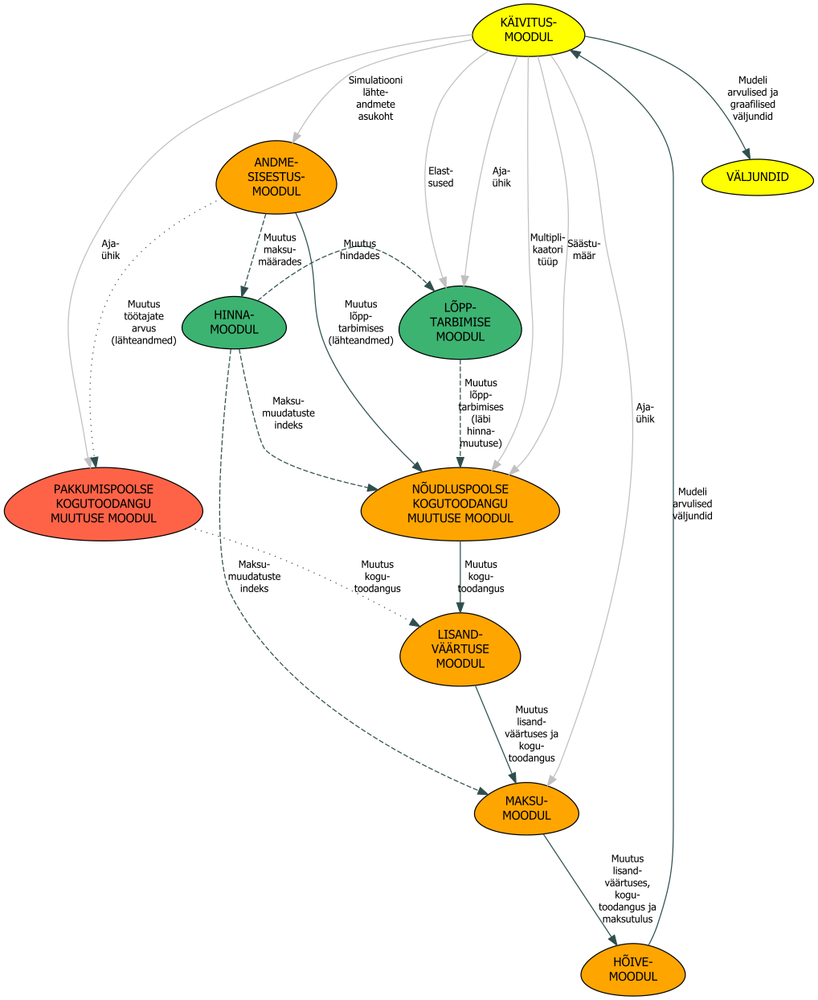

```{css caption-to-the-top, echo = FALSE}
/* Makes figure caption behave like table caption and places is to the top*/ 
div.figure {
  display: table;
  width:100%;
}
div.figure p {
  display: table-caption;
  caption-side: top;
  width: 100%;
}
caption {
  text-align: left !important;
  color: #333333 !important;
} 

.math {
  font-size: small;
}
```

```{r setup, include=FALSE}
knitr::opts_chunk$set(echo = FALSE,
                      message = FALSE,
                      warning = FALSE)

# Directories
wd <<- ".."
script_loc <<- file.path(wd, "1.scripts")  
data_loc <<- file.path(wd, "2.data")
dict_loc <<- file.path(wd, "3.dictionaries")
input_ex_loc <<- file.path(wd, "4.user_input_examples")
test_loc <<- file.path(wd, "9.testground") 
#load(file.path(data_loc, "ibi_IO_elements.Rda"))

# Scripts
source(file.path(script_loc,"packages.R"), encoding = "UTF-8")
source(file.path(script_loc,"IO_functions.R"), encoding = "UTF-8")
source(file.path(script_loc,"support_functions.R"), encoding = "UTF-8")

# More convenient namest for sectors
dict_baas = read_excel(file.path(dict_loc, "dictionaries.xlsx"))
dict = unique(dict_baas$IO_lühike)

# Set proper decimal operator
options(OutDec= ",")

# Set theme
ggthemr('fresh')
```

# Sissejuhatus

RITA-C19-makromudel on projekti "COVID-19ga seotud tegevuspiirangute
sotsiaalse ja majandusliku mõju ja riigi kriisimeetmete tõhususe
hindamine elanikkonna sotsiaalmajandusliku heaolu maksimeerimiseks"
käigus välja töötatud simulatsioonimudel, mis hindab koroonaviiruse või
mõne muu šoki/riigipoolse sekkumise tagajärjel lõppkasutamises toimunud
muutuse mõju Eesti majandusele.

Lühidalt kokku võttes läbib mudel järgmised sammud:

1.  Kasutaja defineerib stsenaariumi, mis sisaldab kas maksumäärade (sotsiaalmaks, töötuskindlustusmaksed või käibemaks) muutusi, muutusi lõppkasutamises või muutusi töötajate arvus.
    
2.  Kui stsenaariumi sisaldab maksumuudatusi, siis leitakse esmalt maksumuudatuste mõju lõppkasutamisele. Selleks:

    -   Leitakse, kui suur on nominaalsete maksumäärade protsentuaalne
        suurenemine.

    -   Eeldatakse, et sama palju suureneb ka maksutulu.

    -   Leitakse maksutulu suurenemise osakaal kogutoodangus ning seda
        käsitletakse maksude suurenemisest tingitud hinnatõusuna
        (eeldades, et kogu maksukoormuse muutus kantakse otse üle).

    -   Seejärel leitakse kodumajapidamiste nõudluse hinnaelastsuste
        abil muutus kodumajapidamiste lõpptarbimises.

    -   Käibemaksu puhul on lähenemine veidi teistsugune (vt täpsemalt
        maksumooduli kirjeldusest).

2.  Maksumuudatustest tulenev lõppkasutamise muutus liidetakse
    stsenaariumi kirjelduses ette antud lõppkasutamise muutustele
    (eeldusel, et stsenaariumi kirjeldus üldse mingit täiendavat
    lõppkasutamise muutust ette näeb, üldjuhul soovitame samaaegselt lõppkasutamise muutust ja maksumuudatusi mitte modelleerida).

3.  Lõppkasutamise muutustest võetakse maha käibemaks (erandiks on
    eksport, mis on käibemaksu vaba) ja impordi osa lõppkasutamises

4.  Alles jäänud muudatused lõppkasutamises korrutatakse läbi tootmise
    multiplikaatoritega, saades mõju kogutoodangule.

5.  Lisandväärtuse, tööjõukulu ja kasumi mõju saadakse, võttes arvesse
    vastavate näitajate osakaalu kogutoodangus (majandustegevusalade
    lõikes).

6.  Mõju maksutulule leitakse iga maksu maksubaasi ning efektiivsete
    maksumäärade korrutisena (käibemaksu puhul on siin jällegi erandid).
    Kui muutusid maksumäärad, siis avaldub selle mõju läbi kahe kanali:

    -   Maksumäära muutusest tulenev lõpptarbimise muutus - seda juba
        eelnevalt kirjeldati. Maksutõus toob meie mudelis kaasa
        lõpptarbimise vähenemise ning see mõjutab maksude laekumist
        negatiivselt.

    -   Maksumäära muutusest tulenev otsene maksutulu muutus - kui
        nominaalne maksumäär muutub, siis muutub protsentuaalselt sama
        palju ka maksutulu. Näiteks, kui maksumäär suureneb 10%, siis
        suureneb ka kogu maksutulu 10%.

    -   Lõplik mõju maksude laekumisele on nende efektide summa.

Need sammud on mudeli moodulite vahel ära jagatud. Moodulid on järgmised:

-   Käivitusmoodul

-   Andmesisestusmoodul

-   Hinnamoodul

-   Lõpptarbimise (muutuse) moodul

-   Nõudluspoolse kogutoodangu muutuse moodul

-   Pakkumispoolse kogutoodangu muutuse moodul

-   Lisandväärtuse moodul

-   Maksumoodul

-   Hõivemoodul

Järgnevalt selgitamegi iga mooduli ülesehitust.

# Käivitusmoodul

Selle mooduli abil käivitatakse simulatsioonimudeli erinevad moodulid
ning korraldatakse nendevahelist andmevahetust. Mudeli võib käivitada
ilma parameetriteta (sellisel juhul küsitakse sisendeid jooksvalt), või
siis käsurealt, andes vajalikud parameetrid teksti kujul ette.
Parameetrite liikumine on kujutatud mudeli skeemil hallide nooltena (vt
joonist \@ref(fig:skeem-total)).

```{r skeem-total, fig.cap = "Mudeli ülesehitus", fig.height=0.1}
par(mar = c(0, 0, 0, 0))
plot.new()
```

 Mudel võimaldab simuleerida kolme tüüpi
sekkumisi. Selleks kasutatakse erinevaid moodulite kombinatsioone, nende
paremaks eristamiseks oleme moodulid tähistanud eri värvidega.
Simuleeritavad sekkumised on järgmised:

-   **Muutus lõpptarbimises (nt investeering teedeehitusse)** - seda
    tüüpi muudatuste modelleerimisel toimuvat info liikumist kirjeldavad
    käivitusmooduli ning oranžide moodulite vahele tõmmatud jooned.
    Punased ja rohelised moodulid jäävad seda tüüpi simulatsioonidest
    kõrvale.
-   **Muutus töötajate arvus (nt inimeste haigestumine ja tööturult
    eemale jäämine)** - andmete liikumine toimub käivitusmooduli ning
    punast ja oranži värvi moodulite vahele tõmmatud joonte järgi.
    Käivitusmoodulist liiguvad parameetrid andmesisestusmoodulisse,
    sealt pakkumispoolse kogutoodangu muutuse moodulisse ning sealt
    edasi lisandväärtuse moodulisse, maksumoodulisse, hõivemoodulisse
    (mis küll simulatsioonile midagi ei lisa, sest simulatsiooni sisend
    määrab juba töötajate arvu muutuse ära). Nõudluspoolset kogutoodangu
    muutuse moodulit ning rohelist värvi mooduleid seda tüüpi
    simulatsioonid ei läbi.
-   **Muutus käibemaksu, sotsiaalmaksu või töötuskindlustusmaksete
    määrades** - siin liiguvad andmed andmesisestusmoodulist esmalt
    rohelise värviga tähistatud hinna- ja lõpptarbimismoodulisse (et
    leida, kui palju maksutõus hindu ja seeläbi ka lõpptarbimist
    mõjutab) ning sealt edasi juba nõudluspoolse kogutoodangu muutuse
    moodulisse, lisandvärätuse moodulisse ning maksu- ja
    hõivemoodulitesse.

Olenemata sellest, milliseid muudatusi läbi mängitakse, savestatakse
tulemused lõpuks kaheosalisse listi (joonisel tähistatud andmesildiga
"VÄLJUNDID"). Listi esimene element ("Andmed") sisaldab simulatsiooni
tulemuste toorandmeid, teine "Joonised" olulisemaid simulatsiooni
tulemusi graafilisel kujul.

Mooduli sisendid ja väljundid:

-   Sisendid - mooduli sisendid jagunevad kaheks:

    -   Mudeli arvutusi mõjutavad sisendid:

        -   **andmed** - sisendandmeid sisaldava faili asukoht (vaata
            näidiseid kataloogis '4.user_input_examples').

        -   **intervall** - sisendandmete ajaarvestuse periood. Võib
            olla: c("kuu", "aasta").

        -   **elastsused** - simulatsiooni kasutatavad nõudluse
            hinnaelastsused. On kolm valikut c("null", "miinusyks",
            "ekspert"). Esimesel juhul eeldatakse, et kõigi tegevusalade
            toodete/teenuste hinnaelastsused on nullid, teisel juhul
            miinus ühed ning kolmandal juhul võrdsed kirjanduse analüüsi
            põhjal kokku koondatud väärtustega. Elastsused ise on
            andmete kataloogis, failis "elasticities.xlsx".

        -   **multiplikaatorid** - Leontiefi tootmismultiplikaatorid,
            mida simulatsioonis kasutatakse. Valida saab kahte tüüpi
            multiplikaatoreid c("I", "II").
            
        -   **saastumaar** - see osa kodumajapidamiste sissetulekust, mille nad säästavad. Säästumäära kasutatakse tingitud efektide arvutamisel (ehk siis, kui kasutatakse II tüüpi multiplikaatoreid). Kui säästumäär on 10,5%, siis tuleks see sisestada kujul 10.5.
        
        -   **hoive** - andmestik, mille põhjal on leitud töötajate jaotumine majandustegevusalade vahel. Valida saab c("ETU", "EMTA"). Soovitame kasutada ETUt.  

    -   Väljundite vormistust mõjutavad sisendid:

        -   **label_raha** - telje nimi rahas mõõdetavatele näitajatele.

        -   **label_inimest** - telje nimi hõivenäitajatele.

        -   **murra_y** - Y telje andmesiltide maksimaalne pikkus
            tähemärkides.

        -   **murra_f** - fassetil esitatava teksti maksimaalne pikkus
            tähemärkides.

        -   **f_axes_y** - kas fassetid peaksid paiknema y teljel,
            valik: c(TRUE, FALSE).

        -   **vaikselt** - kas mudel peaks mudeli kasutamise käigus
            kuvatavaid tekste mitte näitama (kasulik Rmd raportite
            koostamisel), valik: c(TRUE, FALSE).

-   Väljund - list, mille element "Joonised" sisaldab simulatsiooni
    tulemusi esitatuna joonistel ning element "Andmed" tulemusi
    andmefailina.

# Andmesisestusmoodul

Moodul küsib sisendandmeid MS Exceli formaadis, sisendandmete näidiste
kaustas ("4.user_input_examples") toodud kujul. Andmed loetakse sisse
ning salvestatakse eraldi andmeobjektidesse:

-   Lõppkasutamine - muutused lõppkasutuses esitatakse
    absoluutsummadena. Tekivad järgmised andmestikud:

    -   d_household_FD - muutus kodumajapidamiste lõpptarbimises, lehelt
        "kodumajapidamised"

    -   d_investments_FD - muutus investeeringutes, lehelt
        "investeeringud"

    -   d_govexp_FD - muutus valitsussektori kulutustes, lehelt
        "valitsussektor"

    -   d_exports_FD - muutus ekspordis, lehelt "eksport"

-   Hõive - muutused hõives esitatakse samuti absoluutsummana. Tekib
    järgmine andmestik:

    -   d_empl - muutus töötajate arvus, lehelt "töötajate arv"

-   Maksumäärad - maksumäärade puhul ei esitata mitte muutust, vaid uus
    maksumäär:

    -   d_VAT_20 - käibemaksu tavamäär, lehelt "uus käibemaks 20"

    -   d_VAT_9 - käibemaksu erimäär, lehelt "uus käibemaks 9"

    -   d_ST - sotsiaalmaksu määr, lehelt "uus sotsiaalmaks"

    -   d_UIC - töötuskindlustusmaksete määrade summa, lehelt "uus TKM"

Sisseloetud andmetega tehakse järgnevad ettevalmistavad protseduurid:

-   Lõppkasutamise ja hõivatute arvu muutusi sisaldavatelt lehtedelt
    sisse loetud andmestikes asendatakse puudavad vaatlused (tühjad
    lahtrid) nullidega.

-   Maksumäärasid sisaldavatelt lehtedelt sisse loetud andmestikes
    asendatakse tühjad lahtrid viimaste teada olevate maksumääradega
    (need loetakse sisse "2.data" kataloogis paiknevast failist:
    "nominal_tax_rates_by_sector.xlsx")

-   Tulba päiste töötlus - kui tulba päised on MS Exceli kuupäeva
    formaadis, siis konverteeritakse need as.Date() funktsiooni abil
    kuupäeva formaati. Olgu mainitud, et mudel oskab arvutusi teha vaid
    kuiste ja aastaste andmetega (tulba päises võib (ja peabki) kuupäeva
    esitada päeva täpsusega, kuid kui ajaühik on kuu, siis esitatakse
    tulemused ikkagi kuude lõikes, kui ei, siis eeldatakse, et tegemist
    on aastaste andmetega).

Mooduli sisendid ja väljundid:

-   Sisendid:

    -   **file_path** - sisendandmeid sisaldava faili asukoht.

-   Väljund - üheksast data.frame formaadis andmestikust koosnev list,
    millest esimesed neli sisaldavad absoluutmahus muutusi õpptarbimise
    komponentides, viies muutust hõivatute arvus ning ülejäänud neli
    uusi käibemaksu (eri- ja tavamäär), sotsiaalmaksu ja töötuskindlustusmaksete määrasid.

# Hinnamoodul

## Sissejuhatus

Moodul loeb andmesisestuse mooduli väljundist sisse maksumäärade
muudatused ning arvutab nende põhjal maksutõusust tuleneva tegevusala
keskmise toote/teenuse hinna protsentuaalse muudatuse. Muuta saab sotsiaalmaksu, töötuskindlustusmaksete
ja käibemaksu määrasid. Muude maksude muutmise mõju hindadele selle mudeliga analüüsida ei saa.

Üldine lähenemine on järgmine:

-   Loeme sisse info nominaalsete maksumäärade kohta ja arvutame nende
    muutumise indeksid
-   Leiame maksumäärade muutuse mõju tootmiskuludele
-   Leiame tootmiskulude muutuse mõju hinnatasemele

## Maksumuudatuste indeksid

Alustuseks loeme sisse stsenaariumis defineeritud uued nominaalsed
maksumäärad ja nominaalsed baasmaksumäärad (maksumäärad, mis kehtisid
mudeli koostamise ajal, ehk 2020. aastal) ning konverteerime need
maksumäärade muutuste indeksiteks. Kuna mudel on sektoriaalne, siis saab
igale tegevusalale defineerida eraldi maksumäärad. Need koondatakse
63-elemendilisse maksumäärade vektorisse, kus iga element vastab ühele
tegevusalale. Edaspidi opereerime vektorite ja maatriksitega, see
võimaldab valemeid veidi kompaktsemalt kirjutada.

Iga maksuliigi (käibemaks tavamääras, käibemaks erimääras, sotsiaalmaks,
töötaja- ja tööandja töötuskindlustusmaksete summa) kohta arvutatakse
iga tegevusala maksumuudatuste indekeseid sisaldav vektor vastavalt
järgmisele valemile:

```{=tex}
\begin{equation} 
  t_{ind} = t_{1} \oslash t_{0} 
  (\#eq:ti)
\end{equation}
```
kus

$t_{ind}$ - maksumäära muutust väljendavate indeksite vektor
($63\times1$ tegevusala)

$t_{1}$ - muudatusjärgsete maksumäärade vektor ($63\times1$ tegevusala)

$t_{0}$ - muudatuse-eelsete maksumäärade vektor ($63\times1$ tegevusala)

$\oslash$ - Hadamard jagatis (vektorid jagatakse läbi element elemendi
kaupa)

Kui sisendandmetes on maksumäära väli tühi, siis käsitletakse seda kui
infot, et maksumäär ei muutunud (maksumäära muutuse indeks on nendel
juhtudel võrdne ühega).


## Maksumäärade muutuse mõju tootmiskuludele ja hindadele
### Sissejuhatus
Seejärel leiame maksumäärade muutuse mõju tootmiskuludele. Kui tööjõumaksud muutuvad, siis muutuvad ka toodete toomise kulud (tööjõukulu muutub). Soovime teada, kui palju muutub selle tulemusena
kogutoodangu maksumus. Kui eeldame, et kogu tootmiskulu muutus kantakse üle
toote hinda, siis peaks maksutulu absoluutse muutuse ja kogutoodangu suhe
näitama, kui palju tootmine kallimaks läks. Selle info abil leiamegi
maksumuudatuse mõju hindadele.

Käibemaksu mõju hindadele toimib teistmoodi, sest sisendite hinda käibemaksu muudatused otseselt ei mõjuta. Kuna käibemaksu hinnamõju arvutamise lahendus on meie mudelis veidi lihtsam kui tööjõumaksude oma, siis alustame sellest.   

### Käibemaks

Nagu öeldud ei mõjuta käibemaks vahetarbimisena kasutatavate toodete/teenuste kulusid. Kui
metallitoodete käibemaks peaks tõusma, siis ehitusettevõtja jaoks palju
ei muutu - mis iganes metallitoodete käibemaks ka pole, saab ta selle
enda käibemaksukohustusest sisendkäibemaksuna maha arvata. Samas
muutuvad metallitooted lõpptarbija jaoks tõesti käibemaksu tõusu võrra
kallimaks (eeldusel, et kogu maksutõus kantakse hinda üle). Seetõttu ei olegi käibemaksu muutusel mõju tootmiskuludele -
selle muutus kajastub otse lõpptarbitavate toodete hinnas.

Leiame, kui palju muutub käibemaksu määrade muutuse tagajärjel
käibemaksu laekumine absoluutsummas ning suhestame selle
kogutoodangusse - kui maksutõus kantakse täies mahus hinda üle, siis peaks tooted minema selle suhte jagu kallimaks. Selleks arvutame keskmise efektiivse käibemaksu määra
enne ja pärast maksumuudatusi. Selle abil leiame muutuse käibemaksu
laekumise absoluutsummas ja suhestame saadud tulemuse kogutoodangusse.

```{=tex}
\begin{equation} 
  t_{e_0} = t'_{e_0} \odot h'_{km} + t''_{e_0} \odot h''_{km}
  (\#eq:KM1)
\end{equation}
```
kus

$t_{e_0}$ - maksumuudatuste eelsete käibemaksu keskmiste efektiivsete
määrade vektor ($63\times1$ tegevusala)

$t'_{e_0}$ - maksumuudatuste eelsete tavamääras käibemaksu efektiivsete
maksumäärade vektor ($63\times1$ tegevusala)

$h'_{km}$ - vektor, mis sisaldab tavamääras käibemaksuga maksustatava
käibe osakaalusid tavamääras ja erimääras maksustatava käibe ning
käibemaksuta käibe summas ($63\times1$ tegevusala)

$t''_{e_0}$ - maksumuudatuste eelsete erimääras käibemaksu efektiivsete
maksumäärade vektor ($63\times1$ tegevusala)

$h''_{km}$ - vektor, mis sisaldab erimääras käibemaksuga maksustatava
käibe osakaalusid tavamääras ja erimääras maksustatava käibe ning
käibemaksuta käibe summas ($63\times1$ tegevusala)

$\odot$ - Hadamard korrutis (vektorid korrutatakse läbi element elemendi
kaupa)

```{=tex}
\begin{equation} 
  t_{e_1} = t'_{e_0} \odot h'_{km} \odot t'_{ind}+ t''_{e_0} \odot h''_{km} \odot t''_{ind}
  (\#eq:KM2)
\end{equation}
```
kus

$t_{e_1}$ - maksumuudatuste järgsete käibemaksu keskmiste efektiivsete
määrade vektor ($63\times1$ tegevusala)

$t'_{e_0}$ - maksumuudatuste eelsete tavamääras käibemaksu efektiivsete
maksumäärade vektor ($63\times1$ tegevusala)

$h'_{km}$ - vektor, mis sisaldab tavamääras käibemaksuga maksustatava
käibe osakaalusid tavamääras ja erimääras maksustatava käibe ning
käibemaksuta käibe summas ($63\times1$ tegevusala)

$t''_{e_0}$ - maksumuudatuste eelsete erimääras käibemaksu efektiivsete
maksumäärade vektor ($63\times1$ tegevusala)

$h''_{km}$ - vektor, mis sisaldab erimääras käibemaksuga maksustatava
käibe osakaalusid tavamääras ja erimääras maksustatava käibe ning
käibemaksuta käibe summas ($63\times1$ tegevusala)

$t'_{ind}$ - tavamääras käibemaksu maksumäära muutust väljendavate
indeksite vektor ($63\times1$ tegevusala)

$t''_{ind}$ - erimääras käibemaksu maksumäära muutust väljendavate
indeksite vektor ($63\times1$ tegevusala)

$\odot$ - Hadamard korrutis (vektorid korrutatakse läbi element elemendi
kaupa)

```{=tex}
\begin{equation} 
 \Delta t_g = (t_{e_1}-t_{e_0}) \odot (m_k+w_k) \oslash g
  (\#eq:KMl)
\end{equation}
```
kus

$\Delta t_g$ - vektor, mis sisaldab käibemaksu laekumise absoluutseid
muutusi suhtena kogutoodangusse ($63\times1$ tegevusala)

$t_{e_0}$ - maksumuudatuste eelsete käibemaksu keskmiste efektiivsete
määrade vektor ($63\times1$ tegevusala)

$t_{e_1}$ - maksumuudatuste järgsete käibemaksu keskmiste efektiivsete
määrade vektor ($63\times1$ tegevusala)

$m_k$ - kodumaise impordi tarbimise vektor ($63\times1$ tegevusala)

$w_k$ - kodumaiste tootete ja teenuste lõpptarbimiselt tekkiva
lisandväärtuse vektor ($63\times1$ tegevusala)

$g$ - kogutoodangu vektor ($63\times1$ tegevusala)

$\odot$ - Hadamard korrutis (vektorid korrutatakse läbi element elemendi
kaupa)

$\oslash$ - Hadamard jagatis (vektorid jagatakse läbi element elemendi
kaupa)

### Sotsiaalmaks ja töötuskindlustusmaksed

Sotsiaalmaksu ja töötuskindlustusmaksete määrade tõus mõjutab
tootmissisendite maksumust (ehk siis vahetarbimist), seetõttu tuleb
võtta arvesse vahetarbimise struktuuri. Esmalt leiame maksutulu absoluutse
muutuse suhte kogutoodangusse:

```{=tex}
\begin{equation} 
 \Delta t_g = (t_{e_1}-t_{e_0}) \odot w_e \oslash g
  (\#eq:SMl)
\end{equation}
```
kus

$\Delta t_g$ - vektor, mis sisaldab vaatlusaluse maksu laekumise absoluutseid
muutusi suhtena kogutoodangusse ($63\times1$ tegevusala)

$t_{e_0}$ - maksumuudatuste eelsete efektiivsete maksumäärade vektor ($63\times1$ tegevusala)

$t_{e_1}$ - maksumuudatuste järgsete efektiivsete maksumäärade vektor ($63\times1$ tegevusala)

$w_e$ - tööjõukulu (sotsiaalmaksu maksubaas) vektor ($63\times1$
tegevusala)

$g$ - kogutoodangu vektor ($63\times1$ tegevusala)

$\odot$ - Hadamard korrutis (vektorid korrutatakse läbi element elemendi
kaupa)

$\oslash$ - Hadamard jagatis (vektorid jagatakse läbi element elemendi
kaupa)

Maksutõusu muutuse toodete/teenuse lõpphinnale leiame Leontiefi
hinnamudeli abil (@eurostat2008, lk 490-492). Sisend-väljundtabeli
elementidega tehtavaid arvutusi esitame maatriksarvutuste vormis.
Leontiefi hinnamudel on koguste mudeli (selle, mida kasutame toomise
multiplikaatorite leidmiseks) pöördmudel. Hinnamudel võtab sisendiks
sisend-väljundtabeli tehniliste koefitsientide maatriksi ning
lisandväärtuse, impordi ja netotootemaksude summaarse osakaalu
kogutoodangus, ning arvutab nende põhjal tegevusalade keskmiste toodete
hinnad. Eesti sisend-väljundraamistikus pole infot toodete hindade kohta. Sellises olukorra eeldatakse tavaliselt, et kõigi tegevusalade
toodete ühiku maksumuseks on 1 rahaühik (euro). Seda väljendab ka
alljärgnev valem:

```{=tex}
\begin{equation} 
  p_0 = (I-Ad')^{-1}*v' 
  (\#eq:pmodel1)
\end{equation}
```
kus

$p_0$ - hinnatase enne maksumuudatusi ($63\times1$ tegevusala)

$I$ - ühikmaatriks ($63\times63$)

$Ad$ - kodumaise vahetarbimise tehniliste koefitsientide maatriks
($63\times63$ tegevusala)

$v$ - lisandväärtuse, impordi ja netotootemaksude osakaalude summa
kogutoodangus ($63\times1$ tegevusala)

$*$ - maatrikskorrutus

$'$ - transponeerimine

$^{-1}$ - pöördmaatriks

Sellisel kujul läbi viidud arvutus ei ole kuigi kõnekas (tulemuseks on
63 elemendiga ühtede vektor), kuid mudel on siiski huvitav, võimaldades
meil analüüsida sisendites (sh tööjõumaksudes) aset leidvate muutuste
mõju toodete/teenuste hindadele. Teisisõnu -- kui teame, palju
tööjõumaksude muutuse tulemusena tegevusalade tootmiskulud (suhtena
kogutoodangusse) muutusid, võimaldab Leontiefi hinnamudel välja
arvutada, kuidas see (arvestades, et iga tegevusala kasutab teiste
tegevusalade toodangut oma sisendina) läbi majanduse edasi kandub ning
milliseks kujuneb kõigi tegevusalade teenuste/toodangu uus hinnatase:

```{=tex}
\begin{equation} 
  p_1 = (I-Ad')^{-1}*(v+t)' 
  (\#eq:pmodel2)
\end{equation}
```
kus

$p_1$ - hinnatase peale maksumuudatusi ($63\times1$ tegevusala)

$I$ - ühikmaatriks ($63\times63$)

$Ad$ - kodumaise vahetarbimise tehniliste koefitsientide maatriks
($63\times63$ tegevusala)

$v$ - lisandväärtuse, import ja netotootemaksude osakaalude summa
kogutoodangus ($63\times1$ tegevusala)

$t$ - maksutulu muutuse osakaal kogutoodangus ($63\times1$ tegevusala)

Enne hindade suhtelise muutuse väljaarvutamist tuleb arvestada ka
sellega, et tööjõumaksud on lisandväärtuse osa. Kuna lisandväärtuselt
arvestatakse käibemaksu, siis tähendab see, et tööjõumaksu tõus
võimendub tänu käibemaksule.

Hindade suhteline muutus avaldub igal majandustegevusalal järgmise
valemi abil:

```{=tex}
\begin{equation} 
  \Delta p = (p_1 - p_0) * (1+t_{e})
  (\#eq:pmodel3)
\end{equation}
```
kus

$\Delta p$ - hindade suhtelise muutuse vektor ($63\times1$ tegevusala)

$t_{e}$ - keskmiste käibemaksu efektiivsete määrade vektor
($63\times1$ tegevusala)

Tööjõumaksude ja käibemaksu samaaegset muutmist mudel praegu ei võimalda
(see viib vigaste tulemusteni).

## Mooduli sisendi ja väljundid

-   Sisendid:

    -   **data_i** - andmesisestusmooduli väljundiks olev 9 elemendiga
        list.
    -   **year** - aasta, mille kohta on mudelisse sisestatud viimased
        andmed kogutoodangu, lisandväärtuse sektoraalse jaotuse,  maksutulu ja hõivatute kohta (mudeli loomise hetkel 2020).

-   Väljundid:

    -   Kahetasandiline list, millest esimesel tasandil jagatakse
        väljundid hinnamuudatusteks ja maksumuudatustes. Hinnamuudatuste
        all on toodud eraldi andmestikes: a) käibemaksu määrade, b)
        sotsiaalmaksu määra ja c) töötuskindlustusmaksete (summaarsest)
        määrast tulenevad protsentuaalsed muutused majandustegevusala
        toodete ja teenuste keskmises hinnatasemes. Maksumuudatuste all
        on tegevusalade lõikes muutused (väljendatuna indeksina, kus 1
        tähendab, et määr ei muutunud): a) käibemaksu tavamääras, b)
        käibemaksu erimääras, c) sotsiaalkindlustusmaksu määras d)
        töötuskindlustusmaksete (summaarses) määras.

# Lõpptarbimise muutuse moodul

## Sissejuhatus

Moodul leiab maksumuudatuste tulemusena toimuva hindade muutuse mõju
kodumajapidamiste lõpptarbimisele. Hinnamuutused mõjutavad selles mudelis ainult
kodumajapidamiste lõpptarbimist (valitsussektori kulutusi,
investeeringuid ja eksporti hinnatõus meie mudelis ei mõjuta).

Üldine lähenemine on järgmine:

-   Valime sobivad tegevusala keskmised hinnaelastused (nullid,
    miinusühed või eksperthinnangu põhised)
-   Leiame elastsuste ja hinnatõusude korrutise tulemusena
    protsentuaalse kodumajapidamiste lõpptarbimise muutuse
    majandustegevusalade lõikes
-   Korrutame (pärast mõningast kohandamist) kodumajapidamiste
    lõpptarbimise maksumuudatuse eelsed kulutused läbi lõpptarbimise
    protsentuaalse muutusega ja saame lõpptarbimise absoluutse muutuse

## Elastsused

Hinnatõusu ja lõpptarbimise muutumise vahelise seose defineerivad
hinnaelastsused. Nende leidmiseks viidi läbi leibkonnaeelarveuuringu
mikroandmetel põhinev eraldiseisev analüüs, vaadates juurde ka teiste
riikide kogemust (@tü2021) [^1]. Analüüsi detaile ei hakka siinkohal
avama, olgu vaid öeldud, et leibkonnaeelarve uuringu ja kasutatud
hinnaindeksite detailsus jäi lõpuks siiski liialt väikeseks, et
hinnaelastsuste kohta kasutatavaid tulemusi saada. Seetõttu koostati
kolm alternatiivset elastsuste komplekti:

[^1]: Täpsemalt saab selle kohta lugeda siit:
    <https://andresvork.github.io/Raport_EE_LEUmikro.html>

-   null - selles komplektis eeldatakse, et kõigi tegevusalade toodete
    kodumajapidamiste lõpptarbimise hinnaelastsus on null (hinnad
    lõpptarbimist ei mõjuta).

-   miinusüks - kõigi tegevusalade toodete kodumajapidamiste
    lõpptarbimise hinnaelastsus on miinus üks, ehk 1% hinnatõus toob
    kaasa 1% kodumajapidamiste lõpptarbimise vähenemise.

-   ekspert - selles komplektis on erinevate analüüside põhjal kokku
    pandud nö parim pakkumine, mida soovitame käesolevas töös
    kasutada.

## Kodumajapidamiste lõpptarbimise suhteline muutus

Hinnatõusu suhteline mõju kodumajapidamiste lõpptarbimisele avaldub
hinnaelastsuse ja hinnamuutuse korrutisena. See leitakse järgmise valemi abil:

```{=tex}
\begin{equation} 
   \Delta d_\% = e \odot \Delta p_\% 
  (\#eq:elastsus)
\end{equation}
```
kus

$\Delta d_\%$ - kodumajapidamiste lõpptarbimise suhtelise muutuse vektor
($63\times1$ tegevusala)

$e$ - tegevusalade keskmiste hinnaelastsuste vektor ($63\times1$
tegevusala)

$\Delta p_\%$ - tegevusalade toodangu hinna suhtelise muutuse vektor
($63\times1$ tegevusala)

$\odot$ - Hadamard korrutis (vektorid korrutatakse läbi element elemendi
kaupa)

## Kodumajapidamiste lõpptarbimise absoluutne muutus

Kodumajapidamiste lõpptarbmise absoluutse muutuse leidmiseks tuleb iga
tegevusala toodangu lõpptarbimise absoluutne tase korrutada läbi selle
suhtelise muutusega. Kodumajapidamiste lõpptarbimise absoluutse taseme
leiame pakkumise ja kasutamise tabelitest. Kuna pakkumise ja kasutamise tabeleid koostatakse pika viitajaga, siis tuleb sealt pärinev kodumajapidamiste lõpptarbimise hivektor konverteerida tänastesse hindadesse. Kasutame selleks SKP nominaalkasvu indeksit. Iga tegevusala
toodete/teenuste jaoks leitakse simulatsiooni-eelne lõpptarbimise
absoluutne tase järgmise valemi abil:

```{=tex}
\begin{equation} 
  d_{k_g} = d_{k_{IOb}} \times SKP_{ind_{tb}}
  (\#eq:dkohand)
\end{equation}
```
kus

$d_{k_g}$ - kodumajapidamiste tegevusala *ta* toodangu lõpptarbimise
simulatsioonieelne absoluutne tase analüüsi stsenaariumi realiseerumise
aastal

$d_{k_{IOb}}$ - vektor, mis sisaldab kodumajapidamiste lõpptarbimise
absoluutset taset aastal, mille kohta on koostatud mudelis kasutatavad pakkumise ja
kasutamise tabelid (mudeli koostamise ajal 2017) ($63\times1$
tegevusala)

$SKP_{ind_{tb}}$ - SKP nominaalne tase aastal, mille maksulaekumisi ja
hõivenäitajadi arvutustes kasutatakse (mudeli koostamisel ajal aasta
2020) jagatud SKP nominaalse tasemega aastal, mille kohta on koostatud
mudelis kasutatavad pakkumise ja kasutamise tabelid (mudeli koostamise
ajal aasta 2017).

Lisaks eeltoodule ei tohi unustada, et mudeliga läbimängitavad
stsenaariumite ajaühikud võivad olla nii kuised kui aastased - kui
stsenaariumi lõpptarbimise muudatused on esitatud kuude kohta, siis
tuleb lõpptarbimise absoluutne tase jagada 12-ga.

```{=tex}
\begin{equation} 
  d_{k_g} = \frac{d'_{k_g}}{12}  
  (\#eq:dkuu)
\end{equation}
```
kus

$d_{k_g}$ - kodumajapidamiste lõpptarbimise vektor eeldusel, et stsenaariumi
andmed on kuised ($63\times1$ tegevusala)

$d'_k$ - kodumajapidamiste lõpptarbimise vektor eeldusel, et
stsenaariumi andmed on aastased ($63\times1$ tegevusala)

Kokkuvõttes leitakse kodumajapidamiste lõpptarbimise absoluutne muutus
järgmise valemi abil:

```{=tex}
\begin{equation} 
  \Delta d_{k_t} = d_{k_g} \odot \Delta d_\%
  (\#eq:absFDm)
\end{equation}
```
kus

$\Delta d_{k_t}$ - maksumäärade muutusest tulenev kodumajapidamiste
lõpptarbimise absoluutne muutus ($63\times1$ tegevusala)

$d_{k_g}$ - simulatsioonieelne kodumajapidamiste lõpptarbimise vektor
($63\times1$ tegevusala)

$\Delta d_\%$ - kodumajapidamiste lõpptarbimise suhteline muutus
($63\times1$ tegevusala) (vt valem \@ref(eq:absFDm))

Kui soovite, et simulatsioon võtaks arvesse ka sessoonsust (see võib tulla kõne alla kuiste andmete kasutamisel), siis peab
selle ettevalmistama lähteandmete koostamise käigus (ehk siis
lõpptarbimise muudatused peavad juba arvestama sessoonsusega), mudel ise
sessoonseid korrektuure ei tee.

## Mooduli sisendi ja väljundid

-   Sisendid:

    -   **data_i** - hinnamooduli väljundiks olev kahetasandiline list,
        mis sisaldab andmeid hinnamuudatuste ja maksumuudatuste kohta.
    -   **year** - aasta, mille kohta on mudelisse sisestatud viimased
        andmed kogutoodangu, lisandväärtuse sektoraalse jaotuse,  maksutulu ja hõivatute kohta (mudeli loomise hetkel 2020).
    -   **IO_year** - aasta, mille sisend-väljundtabeleid kasutatakse.
    -   **time_interval** - ajaühik, mille lõikes on andmed
        andmesisestusmooduli tabelitesse esitatud. On kaks valikut:
        c("kuu", "aasta").
    -   **elasticity** - simulatsioonis kasutatavad nõudluse
        hinnaelastsused. On kolm valikut c("null", "miinusyks",
        "ekspert"). Esimesel juhul eeldatakse, et kõigi tegevusalade
        toodete/teenuste hinnaelastsused on nullid, teisel juhul miinus
        ühed ning kolmandal juhul võrdsed kirjanduse analüüsi põhjal
        kokku koondatud väärtustega. Elastsused ise on andmete
        kataloogis, failis "elasticities.xlsx".

-   Väljundid:

    -   Ühe elemendiga list, mis sisaldab data.frame formaadis
        andmestikku kodumajapidamiste lõpptarbimise absoluutse muutuse
        kohta.

# Nõudluspoolse kogutoodangu muutuse moodul

## Sissejuhatus

Moodul arvutab lõpptarbimise muutuste mõju kogutoodangule. Arvutus
tugineb Leontiefi multiplikaatormudelile. Kasutada saab nii I (otsesed
ja kaudsed mõjud) kui II (otsesed, kaudsed ja tingitud mõjud) tüüpi
multiplikaatoreid. Viimaste puhul on oluline määratleda säästumäär ehk
see osa kodumajapidamiste sissetulekutest, mida tarbimisse ei suunata.

Üldine lähenemine on järgmine:

-   Kui maksumuudatuste tulemusena on toimunud kodumajapidamiste
    lõpptarbimises muutusi, siis võtame selle arvesse, kui mitte, siis
    lähtume sisendandmetes toodud lõppkasutamise muutustest

-   Lõppkasutamise muutustest võetakse maha käibemaks (erandiks on
    eksport, mis on käibemaksu vaba)

-   Lisaks käibemaksule võetakse lõppkasutamisest maha impordi
    lõppkasutamine (NB! Impordi leke toimub ka vahetarbimises ning seda
    võtavad multiplikaatorid arvesse).

-   Otsesed ja kaudsed mõjud (Leontiefi I tüüpi multiplikaatoritel
    põhinevad arvutused):

    -   Kasutatakse I tüüpi multiplikaatoreid, mis võtavad arvesse seda,
        et iga lõppkasutusse mineva tooteühiku tootmiseks kasutatakse
        sisendina ka teiste tegevusalade toodangut
        (vahetarbimine). Lõppkasutus on otsene mõju, vahetarbimine
        kaudsed mõjud.
    -   Muudatused lõpptarbimises korrutatakse läbi tootmise
        multiplikaatoritega, saades tulemuseks mõju kogutoodangule.
    -   Mõju lisandväärtusele, tööjõukulule ja kasumile saadakse, võttes
        arvesse vastavate näitajate osakaalu kogutoodangus (jällegi
        sektorite lõikes).

-   Otsesed, kaudsed ja tingitud mõjud (Leountiefi II tüüpi
    multiplikaatoritele tuginevad arvutused):

    -   Kasutatakse II tüüpi multiplikaatoreid, mis võtavad lisaks
        otsestele ja kaudsetele mõjudele arvesse ka seda, et nende
        efektide ilmnemiseks tuleb töötajatel teha rohkem tööd ja selle eest saab ka täiendavat tasu, mis omakorda
        mõjutab kodumajapidamiste lõpptarbimist (tingitud efekt). Selle
        arvessevõtmiseks vaatame, kui palju suureneb tegevusalade summaarne netopalk,
        arvame sellest maha säästud ning eeldame, et allesjäänud summa
        kulutatakse proportsionaalselt kodumajapidamiste
        tarbimiskorviga. 
    -   Muudatused lõpptarbimises korrutatakse läbi tootmise II tüüpi
        multiplikaatoritega ja saadakse seeläbi mõju kogutoodangule.
    -   Lisandväärtuse, tööjõukulu ja kasumi mõju saadakse, võttes
        arvesse vastavate näitajate osakaalu kogutoodangus (jällegi
        sektorite lõikes).

## Maksumuudatuste tulemusena toimunud lõppkasutamise muutuste arvesse võtmine

Kui lõppkasutamises on maksumuudatuste tulemusena toimunud muutusi, siis
võetakse need arvesse, liites maksumuudatuste tulemusena
kodumajapidamiste lõpptarbimises toimunud muudatused sisendandmetes
kirjeldatud kodumajapidamiste lõpptarbimises toimunud muutustele
(eeldusel, et selliseid muutusi oli). Maksumäära muutust rakendatakse sisendandmetes kirjeldatud lõpptarbimise muutustele, kuigi
maksumuudatusi ja lõpptarbimise muudatusi oleks üldjuhul siiski tark modelleerida
eraldiseisvalt - nii on selgem, millised olid maksumuudatuste ja
millised stsenaariumiga ette antud lõpptarbimise muutuse tagajärjed.

```{=tex}
\begin{equation} 
  \Delta d_k = \Delta d'_k + \Delta d_{k_t}
  (\#eq:LTsum)
\end{equation}
```
kus

$\Delta d_k$ - kodumajapidamiste lõpptarbimise kogumuutus ($63\times1$
tegevusala)

$\Delta d'_k$ - sisendandmetes kirjeldatud kodumajapidamiste
lõpptarbimise muutus ($63\times1$ tegevusala)

$\Delta d_{k_t}$ - maksumäärade muutusest tingitud kodumajapidamiste
lõpptarbimise muutus ($63\times1$ tegevusala)

## Käibemaksu mahaarvamine lõpptarbimise muutuse kogusummast

Käibemaksu mahaarvamiseks tuleb arvesse võtta võimalikke muutusi
käibemaksu määras. Selleks korrutatakse käibemaksu nominaalsed
baasmäärad (need, mis kehtisid mudeli koostamise ajal, ehk 2020. aastal)
käibemaksu muutumise indeksiga (vt \@ref(eq:ti)).

```{=tex}
\begin{equation} 
  t'_1 =  t'_0 \odot t'_{ind} 
  (\#eq:uusKMtava)
\end{equation}
```
kus

$t'_1$ - maksumuudatuste järgne tavamääras käibemaksu nominaalsete
määrade vektor ($63\times1$ tegevusala)

$t'_0$ - maksumuudatuste eelne tavamääras käibemaksu nominaalsete
määrade vektor ($63\times1$ tegevusala)

$t'_{ind}$ - tavamääras käibemaksu nominaalse määra muudatuse indeksite
vektor ($63\times1$ tegevusala)

$\odot$ - Hadamard korrutis (vektorid korrutatakse läbi element elemendi kaupa)

```{=tex}
\begin{equation} 
  t''_1 =  t''_0 \odot t''_{ind} 
  (\#eq:uusKMeri)
\end{equation}
```
kus

$t''_1$ - maksumuudatuste järgne erimääras käibemaksu nominaalsete
määrade vektor ($63\times1$ tegevusala)

$t''_0$ - maksumuudatuste eelne erimääras käibemaksu nominaalsete
määrade vektor ($63\times1$ tegevusala)

$t''_{ind}$ - erimääras käibemaksu nominaalse määra muudatuse indeksite
vektor ($63\times1$ tegevusala)

$\odot$ - Hadamard korrutis (vektorid korrutatakse läbi element elemendi kaupa)

Kuna ühel tegevusalal võib olla nii tava- kui erimääraga maksustatud
käivet (lisaks ka käivet, mis pole käibemaksuga maksustatud või on
maksustatud nullmääraga), siis tuleb lõppkasutamise summade käibemaksuga
korrigeerimiseks leida kaalutud keskmine nominaalne käibemaksu määr.

```{=tex}
\begin{equation} 
  t = t' \odot h'_{km} + t'' \odot h''_{km}
  (\#eq:KMkaalutud)
\end{equation}
```
kus

$t$ - käibemaksu keskmiste nominaalsete määrade
vektor ($63\times1$ tegevusala)

$t'$ - tavamääras käibemaksu nominaalsete
maksumäärade vektor ($63\times1$ tegevusala)

$h'_{km}$ - vektor, mis sisaldab tavamääras käibemaksuga maksustatava
käibe osakaalusid tavamääras ja erimääras maksustatava käibe ning
käibemaksuta käibe summas ($63\times1$ tegevusala)

$t''$ - erimääras käibemaksu nominaalsete
maksumäärade vektor ($63\times1$ tegevusala)

$h''_{km}$ - vektor, mis sisaldab erimääras käibemaksuga maksustatava
käibe osakaalusid tavamääras ja erimääras maksustatava käibe ning
käibemaksuta käibe summas ($63\times1$ tegevusala)

$\odot$ - Hadamard korrutis (vektorid korrutatakse läbi element elemendi
kaupa)

Keskmise käibemaksumäära abil tuleks korrigeerida neid lõppkasutamise
liike, millelt tasutakse käibemaksu. Meie mudelis saab läbi mängida
muutusi neljas lõpptarbimise komponendis:

-   Kodumajapidamiste lõpptarbimiskulutused (lühendatult
    kodumajapidamiste lõpptarbimine)
-   Kapitali kogumahutus põhivarasse ja väärisesemed (lühendatult
    investeeringud)
-   Valitsemissektori lõpptarbimiskulutused (lühendatult valitsussektori
    lõpptarbimine)
-   Kaupade ja teenuste eksport FOB (lühendatult eksport)

Kuna ekspordilt Eesti riik käibemaksu ei kogu, siis pole vaja ekspordi
nõudluse kasvu ka käibemaksuga korrigeerida (selle üle võib muidugi
vaielda, sest Eesti eksport on mõne teise riigi import ning seal
maksutatakse seda ka käibemaksuga, mis tähendab, et näiteks Rootsi
majanduse elavdumine mõjutab meie majandust siiski Rootsi
käibemaksujärgsete summadega). Kodumajapidamiste lõpptarbimise ning
valitsussektori kulutuste puhul tuleks käibemaks lõpptarbimise kasvust
maha arvata. Investeeringutega on olukord veidi segasem - ühest küljest
on need ettevõtte jaoks käibemaksuvabad (sisendkäibemaksu saab
käibemaksukohustuses maha arvata), samas ei tähenda see aga muud, kui
seda et käibemaksukohustus kantakse üle investeeringute tulemusena
loodud tootmisvahendite abil valmistatavate toodete lõpphinda.
Käesolevas mudelis arvame investeeringute lõppkasutamise muutusest
käibemaksu maha.

Kokkuvõttes korrigeeritakse käibemaksuga kodumajapidamiste eratarbimist,
valitsussektori kulutusi ja investeeringuid. Eksporti meie mudelis Eesti
käibemaksumääradega ei korrigeerita (eeldatakse, et stsenaariumi
kirjeldusse on lisatud juba välisriikide käibemaksuga korrigeeritud
lõppkasutamise muutused).

```{=tex}
\begin{equation} 
  \Delta d = \Delta d' \oslash (1 + t) 
  (\#eq:KMkohandatud)
\end{equation}
```
kus

$\Delta d$ - vektor, mis sisalda lõppkasutamise komponendi muutusi
pärast käibemaksuga korrigeerimist ($63\times1$ tegevusala)

$\Delta d'$ - vektor, mis sisalda lõppkasutamise komponendi muutusi enne
käibemaksuga korrigeerimist ($63\times1$ tegevusala)

$t$ - vektor, mis sisaldab keskmisi nominaalse käibemaksu määrasid
pärast maksumuudatusi ($63\times1$ tegevusala)

$\oslash$ - Hadamard jagatis (vektorid jagatakse läbi element elemendi
kaupa)

## Lõppkasutamise muutuse korrigeerimine kodumaise lõppkasutamise osakaaluga

Meid huvitab lõppkasutamise kasvu mõju Eesti majandusele. Selle leidmiseks tuleb
multiplikaatormudelis kasutada kodumaise toodangu lõppkasutamise muutust, impordi lõppkasutamise kasv kodumaist toodangut ei mõjuta. Kodumaise
lõpptarbimise osakaalu leidmiseks jagame *tegevusala-tegevusala*
sisend-väljundtabelis (selle koostamist selgitame järgmises peatükis)
toodud kodumaise toodangu lõppkasutamise (tegevusalade ja lõppkasutamise
liikide lõikes) kogu lõppkasutamisega. Nii saame kodumaise lõpptarbimise
osakaalud. Mingil põhjusel on investeeringute kodumaine lõppkasutamine
tegevusalal "Muude transpordivahendite tootmine" negatiivne (see paistab
välja ka pakkumise ja kasutamise tabelitest, kus muude
transpordivahendite import on oluliselt suurem kui nende kogutarbimine,
ehk tegemist ei ole sisend-väljundtabeli transformeermisest tekkinud
probleemiga). Eeldame, et selle tegevusala toodete kodumaise toodangu
osakaal investeeringute lõpptarbimises on null. 

Kodumaise lõpptarbimise muutuse leidmiseks korrutame lõpptarbimise muutuse element-element haaval kodumaise lõpptarbimise osakaaluga. 

```{=tex}
\begin{equation} 
  \Delta d_{d} = \Delta d \odot h_d 
  (\#eq:KMKkohandatud)
\end{equation}
```
kus

$\Delta d_d$ - vektor, mis sisaldab lõppkasutamise komponendi
(kodumajapidamiste lõpptarbimine, investeeringud, valitsussektori
lõpptarbimine või eksport) muutusi pärast kodumaise lõppkasutamise
osakaaluga korrigeerimist ($63\times1$ tegevusala)

$\Delta d$ - vektor, mis sisaldab lõppkasutamise komponendi muutusi
pärast käibemaksuga korrigeerimist ($63\times1$ tegevusala)

$h_d$ - vektor, mis sisaldab lõppkasutamise komponendi kodumaise
lõppkasutamise osakaalusid *tegevusala-tegevusala* sisend-väljuntabelis
($63\times1$ tegevusala)

Nüüd teame, kui suur osa lõppkasutamise kasvust (selle komponentide
lõikes) hakkab Eesti majandust läbi multiplikaatorite mõjutama -
$\Delta d_d$ on otsene sisend multiplikaatorarvutusse[^2].

[^2]: Kuna EUROSTATi juhendmaterjal kasutab veidi teistsugust tähistust
    ning edasised valemid pärinevad sellest, siis kasutame meiegi
    järgmises peatükid $d$ asemel tähistust $d$. $\Delta f_{d}$ on
    sellisel juhul vektor, mis sisaldab kodumaise lõppkasutamise muutust
    kõigi 63 sisend-väljundtabelis kajastatud tegevusala kohta. Selle
    alamkomponentideks on kodumajapidamiste lõpptarbimine,
    investeeringud, valitsussektori lõpptarbimine ja eksport.

Käibemaksu laekumise arvutamiseks (maksumoodulis) kirjutame välja ka
impordi lõppkasutamise muutuse.

```{=tex}
\begin{equation} 
  \Delta d_m = \Delta d - \Delta d_d
  (\#eq:implopptarbimine)
\end{equation}
```
kus

$\Delta d_m$ - impordi lõppkasutamise komponendi (kodumajapidamiste
lõpptarbimine, investeeringud, valitsussektori lõpptarbimine või
eksport) absoluutseid muutusi väljendav vektor ($63\times1$ tegevusala)

$\Delta d$ - vektor, mis sisaldab lõppkasutamise komponendi absoluutseid muutusi
($63\times1$ tegevusala)

$\Delta d_d$ - vektor, mis sisaldab kodumaise lõppkasutamise komponendi
absoluutseid muutusi ($63\times1$ tegevusala)

## Otsesed, kaudsed ja tingitud mõjud kogutoodangule

Enne pealkirjas viidatud mõjude juurde liikumist peame selgitama, kuidas
multiplikaatoreid arvutatakse. Selleks on aga vaja teada, kuidas
saadakse pakkumise ja kasutamise tabelitest *tegevusala-tegevusala*
sisend-väljundtabelid.

### Pakkumise ja kasutamise tabelitest tööstusharupõhise sisend-väljundtabelini

Sisend-väljundraamistik leiab mõjuanalüüsides küllaltki sagedast
kasutust, kuna see annab hea ülevaate toodete/teenuste (edaspidi viitame
sõnastusliku mugavuse huvides toodetele/teenustele kui toodetele) ja
tegevusalade (aga ka toodete ja toodete ning tegevusalade ja
tegevusalade) omavahelisest seotusest. Sisend-väljundraamistiku peamised
elemendid on pakkumise ja kasutamise tabelid ning nende põhjal koostatud
sisend-väljundtabelid.

Käesolevas töös pakuvad meile huvi eeskätt tegevusalade omavahelised
seosed. Muu hulgas otsime vastust küsimustele: "mis juhtub, kui
lõpptarbimine mõne tegevusala toodete järgi suureneb või väheneb? Kuidas
mõjutab see teisi majandustegevusalasid, hõivet, lisandväärtust,
ettevõtete kasumeid?" Vastamiseks vajame *tegevusala-tegevusala*
sisend-väljundtabelit.

Statistikaamet avaldab praegu ainult *toode-toode*
sisend-väljundtabeleid (selle raporti koostamise hetkel oli viimane
avaldatud tabel 2015. aasta kohta). Õnneks avaldab statistikaamet ka
pakkumise (Statistiaameti andmebaasis tabel RAT00001) ja kasutamise
tabeleid (statistikaameti andmebaasis tabelid RAT00003 (kogukasutamine)
ja RAT000030 (import)) (@statistikaamet2021). Pakkumise tabelid
näitavad, milliseid tooteid erinevad tegevusalad toodavad, kasutamise
tabelid aga seda, millised tooteid on tegevusaladel oma majandustegevuse
teostamiseks sisendina tarvis. Pakkumise ja kasutamise tabelites olev
info võimaldab soovijatel koostada oma *tegevusala-tegevusala*
sisend-väljundtabeli.

Pakkumise ja kasutamise tabelid ning nendest tuletatud
sisend-väljundtabelid on järgneva ülesehitusega (vt tabelit
\@ref(tab:IO-frame)). Oluline on siinkohal silmas pidada, et joonisel
eristatakse kodumaist ning importnõudlust. See võimaldab omakorda
eristada nii vahe- kui lõpptarbimisest selle osa, mis rahuldatakse
impordi toel ning keskenduda osale, mis toodetakse Eestis ja mis elavdab
seeläbi Eesti majandust.

```{r IO-frame, tab.cap="Sisend-väljundraamistik", out.width = '80%'}
dummy_df = data.frame(` ` = character())
names(dummy_df) = c(" ")
dummy_df = flextable(dummy_df) %>%
  border_remove()
dummy_df
```

+-----------------+-------------+-------------+------------+------------+
| PAKKUMISE TABEL | Tegevusalad | Kogutoodang | Import     | Pakkumine  |
+:================+:===========:+:===========:+:==========:+:==========:+
| Tooted          | $V^T$       | $q-m$       | $m$        | $q$        |
+-----------------+-------------+-------------+------------+------------+
| Kogutoodang     | $g^T$       |             |            |            |
+-----------------+-------------+-------------+------------+------------+

+----------------------------+-----------+--------------+--------------+
| KASUTAMISE TABEL           | T         | L            | Kasutamine   |
| (KODUMAINE)                | egevusala | õpptarbimine |              |
+:===========================+:=========:+:============:+:============:+
| Kodumaised tooted          | $U_d$     | $Y_d$        | $q-m$        |
+----------------------------+-----------+--------------+--------------+
| Imporditud tooted          | $U_m$     | $Y_m$        | $m$          |
+----------------------------+-----------+--------------+--------------+
| Lisandväärtus              | $W$       |              | $w$          |
+----------------------------+-----------+--------------+--------------+
| Kogutoodang                | $g^T$     | $y$          |              |
+----------------------------+-----------+--------------+--------------+

+---------------------------------+-----------+--------------+--------+
| IO TABEL - TEGEVUSALA x         | T         | L            | T      |
| TEGEVUSALA                      | egevusala | õpptarbimine | oodang |
+:================================+:=========:+:============:+:======:+
| Kodumaised tegevusalad          | $B_d$     | $F_d$        | $g$    |
+---------------------------------+-----------+--------------+--------+
| Import välismaistelt            | $B_m$     | $F_m$        | $m$    |
| tegevsaladelt                   |           |              |        |
+---------------------------------+-----------+--------------+--------+
| Lisandväärtus                   | $W$       |              | $w$    |
+---------------------------------+-----------+--------------+--------+
| Kogutoodang                     | $g^T$     | $y$          |        |
+---------------------------------+-----------+--------------+--------+

kus

$V^T$ - pakkumise maatriks (*toode-tegevusala*)

$m$ - impordi tulbavektor (toodete lõikes)

$q-m$ - kogutoodangu tulbavektor(toodete lõikes)

$g$ - kogutoodangu vektor (tegevusala lõikes)

$U$ - toodete vahetarbimise maatriks (*toode-tegevusala*)

$Y$ - toodete lõpptarbimise maatriks (*toode-lõpptarbimise komponent*)

$y$ - lõpptarbimise vektor

$W$ - lisandväärtuse maatriks (*lisandväärtuse komponent-tegevusala*)

$w$ - lisandväärtuse vektor

$B$ - vahetarbimise maatriks (*tegevusala-tegevusala*)

$F$ - lõpptarbimise maatriks(*tegevusala-lõpptarbimise komponent*)

$_m$ - indeks tähistamaks importi

$_d$ - indeks tähistamaks kodumaist toodet/tegevusala

$^T$ - indeks tähistamaks seda, et maatriks/vektor on transponeeritud

*Allikas: @eurostat2008, lk 353*

*Tegevusala-tegevusala* sisend-väljundtabeli koostamiseks on vaja teha
mõningaid eeldusi selle kohta, kuidas käsitleda olukordi, kus
tegevusalad toodavad tooteid, mis pole nende põhitooted (nt kui
põllumajandus toodab mingil määral ka metsandustooteid või pakub
majutust). Selle probleemi lahendamiseks soovitatakse (@eurostat2008, lk
316) kasutada "fikseeritud müügistruktuuri eeldust", mis tähendab, et
nende toodete kohta, mis on toodetud väljapool nende "kodutegevusala"
eeldatakse, et neid kasutatakse sarnases proportsiooni vahetarbimiseks
ja lõpptarbimiseks kui selle toote "kodutegevusala" poolt toodetud
vastavat toodet (vt täpsemalt @eurostat2008, lk 316-317). Väljapool
"kodutegevusala" toodetud tooted ja teenused tõstetakse sellest
printsiibist lähtuvalt oma "kodutegevusala" alla ringi, pakkumise tabel
muutub diagonaalmaatriksiks (iga toodet/teenust pakub tema
"kodutegevusala") ning eelpool kirjeldatud fikseeritud müügistruktuuri
eelduse kohaselt korrigeeritud kasutamise tabelist saab selle protsessi
tulemusena *tegevusala-tegevusala* tabel.

Maatrikstehetena esitatuna näeb see protsess välja nii (tähistusi vaata
tabelist \@ref(tab:IO-frame)) (allikas: @eurostat2008, lk 356).

```{=tex}
\begin{equation} 
  T = V \times (diag(q-m))^{-1}
  (\#eq:T)
\end{equation}
```
T on transformatsioonimaatriks. Kui seda korrutada kasutamise tabeli
vahetarbimise osaga ($U$), siis saame tulemuseks *tegevusala-tegevusala*
sisend-väljundtabeli kodumaise toodangu vahetarbimise osa ($B_d$).

```{=tex}
\begin{equation} 
  B_d = T \times U
  (\#eq:Bd)
\end{equation}
```
Kodumaise toodangu lõpptarbimise korrigeerimiseks tuleb
transformatsioonimaatriksit korrutada kasutamise tabeli kodumaise
lisandväärtuse osaga.

```{=tex}
\begin{equation} 
  F_d = T \times Y_d
  (\#eq:Fd)
\end{equation}
```
Lisandväärtuse osa kasutamise tabel korrigeerimist ei vaja, sest see on
esitatud juba majandustegevusalade lõikes.

Leontiefi multiplikaatorite arvutamiseks vajalik tehniliste
koefitsientide maatriks ($A_d$) leitakse järgnevalt:

```{=tex}
\begin{equation} 
  A_d = B_d \times (diag(g))^{-1}
  (\#eq:Ad)
\end{equation}
```
Lisandväärtuse komponentide koefitsiendid ($R$) leitakse nii:

```{=tex}
\begin{equation} 
  R = W \times (diag(g))^{-1}
  (\#eq:R)
\end{equation}
```
Nende komponentide abil on võimalik arvutada multiplikaatorid, mis
näitavad, kui palju suureneb kogutoodang (aga huvi korral ka hõive,
lisandväärtus, kasumid, tööjõukulu jne) kui lõpptarbimine suureneb ühe
ühiku võrra.

### Multiplikaatorid

Vaatame kahte erinevat tüüpi multiplikaatoreid. Alustame Leontiefi I
tüüpi tootmismultiplikaatoritest, mis näitavad, kui palju suureneb
kogutoodang mingi toote/teenuse lõpptarbimise kasvu (otsene mõju) ja
vahetarbimise kasvu (kaudne efekt) tulemusena, kui lõpptarbimine kasvab
ühe ühiku võrra.

Seejärel vaatame, mis juhtub, kui käsitleda kodumajapidamiste tarbimist
endogeensena ja eeldada, et töötajad viivad otseste ja kaudsete efektide
tulemusena elavnenud majandusest tuleneva palgatulu kasvu poodi ning
suurendavad seeläbi omakorda lõpptarbimist, kutsudes esile täiendava
majanduse elavnemise (tingitud efekt). Otseseid, kaudseid ja tingitud
efekte sisaldavat tootmismultiplikaatorid kutsutakse ka Leontiefi II
tüüpi multiplikaatoriks.

#### Leontiefi I tüüpi multiplikaatorid

Majandustegevusalade kogutoodangut on võimalik väljendada järgmise
võrrandisüsteemi abil (siin ja edaspidi on tuginetud @eurostat2008
lehekülgedele 486-487):

```{=tex}
\begin{equation} 
  x_{11} + x_{12} + ... + x_{1n} + x_{1d} = x_1 \nonumber \\
  ... \nonumber \\
  x_{n1} + x_{n2} + ... x_{nn} + x_{nd} = x_{n} \nonumber \\   
  (\#eq:eq-sys-tp)
\end{equation}
```
kus

$x_{ij}$ - majandustegevusala *i* toodete vahetarbimine
majandustegevusala *j* poolt

$x_{id}$ - majandustegevusala *i* toodete lõpptarbimine

$x_{i}$ - majandustegevusala *i* toodete kogutoodang

Kui soovime teada, kui suure proportsionaalse osa tegevusala *j*
sisendivajadusest moodustavad tegevusala *i* tooted, siis leiame selle
järgmiselt:

```{=tex}
\begin{equation} 
  a_{ij} = x_{ij}/x_{j}
  (\#eq:aij)
\end{equation}
```
kus

$a_ij$ - tegevusala *i* toodete osakaal tegevusala *j* sisendivajaduses

Tegevusala *j* vajadus tegevusala *i* sisendite järgi absoluutusummades
avaldub seega järgmiselt:

```{=tex}
\begin{equation} 
  x_{ij} = a_{ij} * x_{j}
  (\#eq:xij)
\end{equation}
```
Asendades võrrandisüsteemis \@ref(eq:eq-sys-tp) $x_{ij}$ valemis
\@ref(eq:xij) esitatuga, saame:

```{=tex}
\begin{equation} 
  a_{11}*x_1 + a_{12}*x_2 + ... + a_{1n}*x_n + x_{1d} = x_1 \nonumber \\
  ... \nonumber \\
  a_{n1}*x_1 + a_{n2}*x_2 + ... a_{nn}*x_n + x_{nd} = x_{n} \nonumber \\ 
  (\#eq:eq-sys-tp-coef)
\end{equation}
```
Kui keskenduda vaid kodumaise toodangu vahe- ja lõpptarbimisele, siis
saab selle võrrandisüsteemi esitada maatrikskujul järgmiselt:

```{=tex}
\begin{equation} 
  A_d \times g + f_d = g
  (\#eq:g1)
\end{equation}
```
kus

$A_d$ - tehniliste koefitsientide maatriks

$g$ - kodumaise kogutoodangu vektor

$f_d$ - lõpptarbimise vekor

Eelpool kirjeldatud muutujaid oleme eelnevalt juba põgusalt puudutanud.
Muude tunnuste kõrval on ainukeseks tundmatuks $f_d$, mis viitab
kodumaise summaarse lõpptarbimise vektorile. Varasemalt esitatud
valemites kasutatud $F_d$ viitas lõpptarbimise maatriksile (selle
komponentide lõikes). Kui soovime teada kogutoodang, kui suureneb
lõpptarbimine, siis saame selle kerge vaevaga avaldada:

```{=tex}
\begin{equation} 
  (I - A_d) \times g = f_d \\
  g - A_d \times g = f_d  \\
  g = (I-A_d)^{-1} \times f_d \\
  \Delta g = (I-A_d)^{-1} \times \Delta f_d \\
  (\#eq:delta-g)
\end{equation}
```
Selleks, et leida kogutoodangu suurenemise vektor, tuleb lõpptarbimise
suurenemise vektor korrutada Leontiefi pöördmaatriksiga. $(I-A_d)^{-1}$
tulbasummad on ühtlasi võrdsed iga tegevusala **kogutoodangu
multiplikaatoritega** ning rea kaupa vaadatuna võimaldavad need hinnata
kui palju ühe tegevusala nõudluse kasv ühe või teise tegevusala toodete
ja teenuste järgi nõudlust suurendab.

$\Delta g$ ongi kodumaise kogutoodangu suurenemise vektor ja näitab,
milline on lõpptarbimise kasvu otsene ja kaudne mõju kogutoodangule.
Mudeli siseselt eristatakse otseseid ja kaudseid efekte ka lõpptarbimise
komponentide lõikes, seega viiakse valemites \@ref(eq:delta-g) toodud
arvutus läbi lõpptarbimise komponentide lõikes. Leontiefi
pöördmaatriksit korrutatakse $\Delta f_{d_i}$ ga ning mudeli selle osa
väljundiks on $\Delta g_i$, kus *i* tähistab lõpptarbimise komponente
(kodumajapidamiste lõpptarbimine, investeeringud, valitsussektori
lõpptarbimine, eksport).

#### Leontiefi II tüüpi multiplikaatorid

Standardses sisend-väljundmudelis on lõpptarbimine eksogeenne. Samas on
mõeldav, et lõpptarbimine võib olla ka endogeenne, näiteks seotud
sissetulekutega.

Endogeense kodumajapidamiste tarbimise puhul laiendatakse vahetarbimise
maatriksit tegevusalade summarsete töötasude rea ja kodumajapidamiste
kulude veeruga. Seejuures vajab otsustamist, millist töötasu näitajat
kasutada. Kasutades tööjõukulude (netopalk + tööjõumaksud) näitajat
eeldame, et otseste ja kaudsete efektide tulemusena lisanduv tööjõu
nõudlus ja selle tõttu suurenev summaarne tööjõukulu (sh tööjõumaksud),
viiakse poodi ning tarbitakse vastavalt kodumajapidamiste ostukorvi
struktuurile ära. Arvestatav osa tööjõumaksudest kulub pensionideks ning
pensionärid eeldatavalt kasutavadki pensioni saranselt keskmise
majapidamise tarbimiskorviga. Samas kulub ca kolmandik sotsiaalmaksust
siiski tervisekindlustusele ning tulumaksul selgelt määratletud
kasutusvaldkonda ei ole, selle kasutamise üle otsustab valitsussektor.
Seega - eeldada, et kõik tööjõumaksud jõuavad kindlasti
kodumajapidamiste tarbimisse ning neid tarbitakse vastavalt nende
tarbimiseelistusele, ei ole õige.

Käesolevas mudelis läheme teist teed ning käsitleme lõpptarbimise
endogeensuse kontekstis töötasuna vaid netopalkasid. See on nö puhtam
lahendus, sest suuname kodumajapidamiste kaudu lõpptarbimise kasvu
ainult kodumajapidamistele väljamakstavad summad, ega aja sassi
kodumajapidamiste ja valitsussektori lõpptarbimise struktuuri.
Sotsiaalkindlustusmaksu tervisekindlustuse osa, aga ka tulumaksu, ei
kulutata kindlasti sama struktuuriga kui kodumajapidamiste sissetulekut.
Kui soovida need rahavood samuti endogeenseks muuta, tuleb leida mingi
teine lahendus, mis jääb antud analüüsi skoobist välja.

Meie poolt valitud lähenemist võiks lugeda konservatiivseks, sest
kodumajapidamiste kulutused on mudelis ainukene endogeenne lõpptarbimise
komponent - investeeringud ja valitsuse lõpptarbimine ei ole. Osad mõjud
(nt eelpool viidatud sotsiaalmaksu laekumise suurenemise kandumine läbi
pensionide kasvu eratarbimisse ning selle täiendav positiivne mõju
majandusele) jäävad seetõttu arvesse võtmata ning majanduse elavdamisele
suunatud meetmete mõju hinnangud tulevad väiksemad kui kõiki mõjusid
arvesse võttes.

Enne teist tüüpi multiplikaatorite arvutamist peame leidma iga
tegevusala jaoks summaarse netopalga (sisend-väljundtabeli real
"..palgad" on toodud tegevusalade summaarsed brutopalgad, peame need
konverteerima netopalgaks).

Brutopalgad viiakse netopalga kujule efektiivse füüsilise isiku
tulumaksumäära abil. Mudeli maksumoodul kasutab efektiivse füüsilise
isiku tulumaksumäära leidmiseks maksubaasina tööjõukulu (tegemist ongi
tulumaksulaekumise suhtega tööjõukulusse), seetõttu ei saa me
efektiivseid tulumaksumaksumäärasid otse brutopalgale rakendada.

Korrigeerime efektiivset tulumaksumäära järgmiselt (vt valemit
\@ref(eq:bta)).

```{=tex}
\begin{equation} 
   w_n = w_b \odot \left(1 - t_e \odot w_e \oslash w_b\right)
  (\#eq:bta)
\end{equation}
```
kus

$w_n$ - summaarse netopalga vektor ($63\times1$ tegevusala)

$w_b$ - summaarse brutopalga vektor ($63\times1$ tegevusala)

$t_e$ - efektiivne füüsilise isiku tulumaksumäär, vektor ($63\times1$
tegevusala)

$w_e$ - summarse tööjõukulu vektor ($63\times1$ tegevusala)

$\odot$ - Hadamard korrutis (vektorid korrutatakse läbi element elemendi
kaupa)

$\oslash$ - Hadamard jagatis (vektorid jagatakse läbi element elemendi
kaupa)

Ka kodumajapidamiste lõpptarbimine vajab kohandamist. Kuna import meie
mudelis majandust ei elavda, siis kasutame lähtepunktina kodumaiste
toodete ja teenuste tarbimise osakaalu (tegevusalade lõikes)
kodumajapidamiste kogutarbimises. Kogutarbimisena kasutame
sisend-väljundtabelis toodud kodumajapidamiste kodumaiste- ja
importtoodete/teenuste tarbimise kogusummat. Seejärel arvutame saadud
osakaaludest maha kodumajapidamiste säästumäära (eeldatavalt ei lähe
kogu sissetuleku kasv tarbimisse). Säästumäära sisestamisel tasub olla
ettevaatlik - kriisisituatsioonis võib see kriisieelsest tasemest
märkimisväärselt erineda ning eeldatavalt on ka kriiside mõju
säästmisele erinev (vt @centar2022).

Lõpetuseks võtame arvesse ka seda, et majandust elavdab meie mudelis
vaid käibemaksu järgne tarbimine.

```{=tex}
\begin{equation} 
  Cd = \frac{Cd_{Abs}}{Cd_{Tot}} \odot (1-s)\oslash (1+t)  
  (\#eq:Cd)
\end{equation}
```
kus

$Cd$ - säästumäära ja käibemaksuga korrigeeritud kodumajapidamiste
lõpptarbimiste osakaalude vektor ($63\times1$ tegevusala)

$Cd_{Abs}$ - kodumajapidamiste kodumaiste kaupade ja teenuste lõpptarbimiste
(absoluutmahus) vektor ($63\times1$ tegevusala)

$Cd_{Tot}$ - kodumajapidamiste kaupade ja teenuste summaarne
lõpptarbimine (absoluutmahus), sisaldab ka importi.

$s$ - kodumajapidamiste säästumäär

$t$ - keskmiste nominaalsete käibemaksumäärade vektor (vt valemit
\@ref(eq:KMkaalutud)) ($63\times1$ tegevusala)

$\odot$ - Hadamard korrutis (vektorid korrutatakse läbi element elemendi
kaupa)

$\oslash$ - Hadamard jagatis (vektorid jagatakse läbi element elemendi
kaupa)

II tüüpi multiplikaatorite arvutamiseks kohandatud (ja stiliseeritud) sisend-väljundtabel näeb välja järgmine.

```{r IO-end-demand, tab.cap="Sisend-väljundraamistik endogeense nõudlusega", out.width = '80%'}
X0 = c("Põllumajandus", "Tootmine", "Teenindus", "Palk")
X1 = c("", "", "", "")
X2 = c("", "Ad", "", "B")
X3 = c("", "", "", "")
X4 = c("", "Cd", "", "E")
dummy_df = data.frame(X0, X1, X2, X3, X4)
rm(X0, X1, X2, X3, X4)
                      
colnames(dummy_df) = c("Tegevusala", "Põllumajandus", "Tootmine", "Teenindus", "Kodumajapidamiste tarbimine")

IO_end = flextable(dummy_df) %>%
  border_remove() %>%
  vline(j = c(1, 4)) %>%
  hline_top(j=c(1, 2, 3, 4, 5)) %>%
  hline(i = c(3))%>%
  align(j = 5, align = "center", part = "body")
IO_end
```

kus

$Ad$ - kodumaise vahetarbimise *tegevusala-tegevusala* tehniliste
koefitsientide maatriks ($63\times63$ tegevusala)

$B$ - netopalkade vektor ($1\times63$ tegevusala)

$Cd$ - korrigeeritud kodumajapidamiste lõpptarbimise vektor ($63\times1$
tegevusala)

$E$ - element, mis kirjutatakse nulliks

$Dd$ - tähis kogu tabelile (sektoritele Ad, B, Cd, E).

*Allikas: @eurostat2008, lk 511*

Tootmise multiplikaatorid leiame järgmise valemi abil:

```{=tex}
\begin{equation} 
  H = (I-D_d)^{-1}
  (\#eq:H)
\end{equation}
```
kus

$H$ - Leontiefi II tüüpi kogutoodangu multiplikaatorid

$I$ - ühikmaatriks

$D_d$ - netopalkade ja korrigeeritud kodumajapidamiste lõpptarbimisega
laiendatud kodumaise toodangu vahetarbimise maatriks

## Mooduli sisendi ja väljundid

-   Sisendid:

    -   **data_i** - andmesisestusmooduli väljundiks oleks üheksa
        elemendiga list, mis sisaldab infot lõpptarbimise muutuse
        (komponentide lõikes) ning nominaalsete maksumäärade muutuse
        kohta (maksude lõikes). Listi elemendid on data.frame
        formaadis.

    -   **data_prices_i** - lõpptarbimise mooduli väljundiks olev
        data.frame formaadis andmestik, mis sisaldab maksumuudatuste
        poolt esile kutsutud hinnamuutuste mõju kodumajapidamiste
        lõpptarbimisele.

    -   **mult_type_i** - multiplikaatori tüüp. Otseste ja kaudsete
        mõjude arvesse võtmiseks tuleks valida "I", otseste, kaudsete ja
        tingitud mõjude arvesse võtmiseks tuleks valida "II" (NB!
        Sellisel juhul tuleks muuta ka säästumäära, mis vaikimisi on
        null).

    -   **hh_savings_rate_i** - säästumäär ehk see osa kodumajapidamiste
        sissetulekust, mille majapidamised säästavad. Säästumäär siseneb
        meie mudelis ainult tingitud efektide arvutustesse. Arv
        vahemikus 0-1.

    -   **year_i** - aasta mille kohta on olemas viimased kogutoodangu
        andmed.

    -   **change_in_tax_rate** - Hinnamooduli väljundiks olevad
        maksumuudatuste indeksid. Andmed on data.frame formaadis.

    -   **household_income_source_i** - Kodumajapidamiste sissetuleku
        allikas. Saab olla kas:

        -   "..palk" - brutopalk.
        
        -   "Hüvitised töötajatele" - palgakulu, sh sotsiaalmaks ja
            töötuskindlustusmaks.

-   Väljundid:

    -   Viieliikmeline list, mille neli esimest elementi sisaldavad
        infot kogutoodangu muutuste kohta lõpptarbimise elementide
        lõikes ning viimane element on muutus impordi lõpptarbimises
        (seda kasutatakse maksumoodulis käibemaksu tulu arvutamiseks).
        Andmed on data.frame formaadis.

# Pakkumispoolse kogutoodangu muutuse moodul

## Sissejuhatus

Moodul arvutab pakkumispoolsete muutuste, mis käesolevas mudelis tuleneb
ainult töötajate arvu muutusest, mõju kogutoodangule, jagades
tegevusalade lõikes töötajate arvu muutuse läbi töötajate arvuga
kogutoodangu ühiku kohta. Hinnata saab kas nõudluse või pakkumise
poolseid mõjusid, mõlemaid korraga hinnata ei saa. Kui stsenaarium peaks
mingil põhjusel sisaldama nii nõudluse kui pakkumise pooleid muutusi,
siis lähtutakse pakkumise poolsest muutusest.

Üldine lähenemine on järgmine:

-   Loeme sisse töötajate arvu muutus tegevusalade lõikes
    (andmesisestusmoodulist)
-   Jagatakse iga tegevusala töötajate arvu muutuse läbi selle tegevusala
    töötajate arvuga ühe kogutoodangu ühiku kohta
-   Kui opereeritakse kuiste andmetega, siis jagame saadud tulemuse
    12-ga.

Väljund on samas formaadis mis nõudluspoolse kogutoodangu muutuse
mooduli väljund. Hõivatute arvu muutusest tulenev kogutoodangu muutus on
kirjutatud kodumajapidamiste lõpptarbimise muutusest tuleneva
kogutoodangu muutuse lehele, ülejäänud lehtedele kirjutatakse nullid.
See võimaldab lisandväärtuse ja maksumooduleid kasutada muutmata kujul
nii nõudluse kui pakkumise poolsete efektide arvutamiseks.

## Töötajate arv kogutoodangu ühiku kohta

Töötajate arv kogutoodangu ühiku kohta leitakse jagades tegevusalade
lõikes töötajate arvud tegevusalade kogutoodanguga. Mudeli parameetrid
võimaldavad selleks kasutada nii EMTA kui Statistikaameti (täpsemalt
tööjõu-uuringu) töötajate arve. Vaikimisi lahenduseks oli läbi projekti
EMTA andmestiku põhine töötajate arvu hinnang, kuigi projekti lõpufaasis
tekitas see mõningate tegevusalade (need, kus on kasutusel palju
võlaõiguslikke lepinguid) hõivenäitajate osas küsimus ning võimalik, et
parem oleks kasutada Statistikaameti tööjõuuuringu andmeid (need on
taandatud täistööajale).

Töötajate arv kogutoodangu ühiku kohta leitakse järgmise valemi abil:

```{=tex}
\begin{equation} 
  l_g =  l \oslash g 
  (\#eq:gemp)
\end{equation}
```
kus

$l_g$ - vektor, mis sisaldab aasta keskmisi töötajate arve kogutoodangu
ühiku kohta ($63\times1$ tegevusala)

$l$ - aasta keskmise töötajate arvu vektor ($63\times1$ tegevusala)

$g$ - kogutoodangu vektor ($63\times1$ tegevusala)

$\oslash$ - Hadamard jagatis (vektorid jagatakse läbi element elemendi
kaupa)

## Töötajate arvu muutusest tulenev kogutoodangu muutus

Kogutoodangu muutuse leidmiseks jagatakse töötajate arvu muutus läbi
töötajate arvuga kogutoodngu ühiku kohta:

```{=tex}
\begin{equation} 
  \Delta g = \Delta l \oslash l_g 
  (\#eq:deltaG)
\end{equation}
```
kus

$\Delta g$ - kogutoodangu muutuste vektor ($63\times1$ tegevusala)

$\Delta l$ - töötajate arvu muutuste vektor ($63\times1$ tegevusala)

$l_g$ - vektor, mis sisaldab aasta keskmisi töötajate arve kogutoodangu
ühiku kohta ($63\times1$ tegevusala)

$\oslash$ - Hadamard jagatis (vektorid jagatakse läbi element elemendi
kaupa)

Kui töötajate arvu muutuse stsenaarium on kuise intervalliga (ei muutu
mitte aasta keskmine töötajate arv vaid ühe kuu töötajate arv), siis
jagatakse saadud tulemus läbi 12-ga.

```{=tex}
\begin{equation} 
  \Delta g = \frac{\Delta g'}{12}
  (\#eq:deltaGkuu)
\end{equation}
```
kus

$\Delta g$ - kuise kogutoodangu muutuste vektor ($63\times1$ tegevusala)

$\Delta g'$ - aastase kogutoodangu muutuste vektor ($63\times1$
tegevusala)

## Mooduli sisendi ja väljundid

-   Sisendid:

    -   **data_i** - andmesisestusmooduli väljundiks olev 9 elemendiga
        list.
    -   **time_interval** - sisendandmete ajaarvestuse periood. Võib
        olla: c("kuu", "aasta").
    -   **year** - aasta, mille kohta on mudelisse sisestatud viimased
        andmed kogutoodangu, lisandväärtuse sektoraalse jaotuse,  maksutulu ja hõivatute kohta (mudeli loomise hetkel 2020).
    -   **source_emp** - töötajate sektoraalse jaotuse baasandmestik c("EMTA", "ETU").

-   Väljundid:

    -   Viieliikmeline list, mille neli esimest elementi sisaldavad
        infot kogutoodangu muutuste kohta lõpptarbimise elementide
        lõikes ning viimane element on muutus impordi lõpptarbimises
        (seda kasutatakse maksumoodulis käibemaksu tulu arvutamiseks).
        Töötajate arvu muutusest tulenev kogutoodangu muutus on
        kirjutatud kodumajapidamiste kogutoodangu muutuse lehele,
        ülejäänud allikatest tulenevad muutused on kirjutatud nulliks.
        Ka impordi sisaldus on seatud nulliks. Andmed on data.frame
        formaadis.

# Lisandväärtuse moodul

## Sissejuhatus

Moodul võtab sisendiks muutused kogutoodangus ning arvutab selle põhjal
mõju lisandväärtusele ning osadele selle komponentidele (tööjõukulule ja
kasumile).

Üldine lähenemine on järgmine:

-   Kui sisendandmetes on töötajate arvu muutused, siis võtame sisendiks
    pakkumispoolse kogutoodangu muutuse mooduli väljundi (moodul 4), kui
    ei, siis nõudluspoolse kogutoodangu muutuse mooduli väljundid
    (moodul 5).
-   Loeme sisse lisandväärtuse ja selle komponentide osakaalud
    kogutoodangus (tegevusalade lõikes).
-   Korrutame muutused kogutoodangus eelmises punktis mainitud
    osakaaludega ja leiame mõju lisandväärtusele ja selle
    komponentidele.

## Mõju lisandväärtusele ja selle komponentide

Mõju lisandväärtuse, tööjõukulule ja kasumile leitakse järgmise valemi
abil:

```{=tex}
\begin{equation} 
  \Delta z = \Delta g \odot b
  (\#eq:z)
\end{equation}
```
kus

$\Delta z$ - meid huvitava näitaja muutuste vektor ($63\times1$
tegevusala)

$\Delta g$ - kogutoodangu muutuste vektor ($63\times1$ tegevusala)

$b$ - vektor, mis sisaldab meid huvitava näitaja (lisandväärtus,
tööjõukulu, kasum) suhet kogutoodangusse ($63\times1$ tegevusala)

$\odot$ - Hadamard korrutis (vektorid korrutatakse läbi element elemendi
kaupa)

Kui meid huvitab lisandväärtus, siis peaks $b$ olema lisandväärtuse
osakaal kogutoodangus, kui kasumid, siis sama näitaja kasumi kohta.

Kuna arvutus põhineb kogutoodangu muutusel, siis kehtib valem
\@ref(eq:z) nii I kui II tüüpi multiplikaatorite kasutamisel.

## Mooduli sisendid ja väljundid

-   Sisendid:

    -   **data_i** - nõudluspoolse kogutoodangu muutuse mooduli
        väljundiks olev viiest elemendist koosnev list, mille neli
        esimest elementi sisaldavad infot kogutoodangu muutuste kohta
        lõpptarbimise elementide lõikes ning viimane element on muutus
        impordi lõpptarbimises.
    -   **data_i\_supply** - pakkumispoolse kogutoodangu muutuse mooduli
        väljundiks olev andmestik (data.frame formaadis), mis sisaldab
        kogutoodangu muutust tegevusalade lõikes.

-   Väljundid:

    -   Kaheastmeline list, kus esimene tase on liigendatud meid
        huvitavate näitajate järgi (kogutoodang, lisandväärtus,
        tööjõukulu, kasum), millele on lisatud lõpptarbimise impordi
        osakaal (kasutame seda maksumoodulis). Iga komponendi all on
        omakorda neljast elemendist koosnev list, elemendid sisaldavad
        erinevate lõppkasutamise komponentide (kodumajapidamiste
        lõpptarbimine, investeeringud, valitsuse kulutused ning eksport)
        muutuse mõju aste kõrgemal olevale näitajale tegevusalade (read)
        ja stsenaariumide (tulbad) lõikes. Listi elemendid on data.frame
        formaadis.

# Maksumoodul

## Sissejuhatus

Moodul võtab sisendiks lisandväärtuse mooduli väljundiks olevad muutused
lisandväärtuses, selle komponentides ning impordi lõpptarbimises ja
arvutab nende põhjal mõju maksulaekumistele (maksuliikide lõikes).
Arvutused põhinevad efektiivsetel maksumääradel. Kui muudetakse
maksumäärasid (võimalikud on muutused käibemaksu, sotsiaalmaksu ja
töötuskindlustusmaksete määrades), siis võetakse arvesse nii
maksumäärade mõju lõpptarbimisele (läbi hinnamuutuste) ning sellest
tulenevalt ka maksulaekumisele kui puhtalt nominaalsete maksumäärade
muutusest tulenevat mõju maksulaekumisele. Efektid esitatakse
agregeeritult.

Üldine lähenemine on järgmine:

-   Saadame lisandväärtuse mooduli väljundi muutmata kujul
    maksumoodulist läbi.

-   Seome maksud nende maksubaasiga (lisandväärtuse komponendid).

-   Agregeerime maksubaasid nende allikate (erinevad lõpptarbimise
    komponendid) üleselt (erandiks on käibemaks, kus peame eristama
    kodumaise lõpptarbimise poolt loodud lisandväärtust (ignoreerides
    eksporti) ja impordi kodumaist tarbimist kui käibemaksu baasi).

-   Mõju maksutulule leiame, korrutades maksubaasi efektiivse
    maksumääraga.

-   Kui muudetakse maksumäärasid, siis selle mõju maksulaekumisele
    avaldub läbi kahe kanali:

    -   Maksumuutus muudab hindu, mis omakorda muudab lõpptarbimist
        ning sealt edasi lisandväärtust ja teisi maksubaase. See muudab
        maksutulu.
    -   Maksumäära muutus muudab maksutulu ka vahetult läbi maksumäära
        suurenemisele - kogu majanduses rakendatakse nüüd teistsugust
        maksumäära. Selle arvesse võtmiseks korrutatakse aastane
        maksutulu läbi nominaalse maksumäära muutuse indeksiga (eeldame,
        et efektiivne maksumäär muutub sama palju).
    -   Kui stsenaarium on defineeritud kuise ajaintervalliga, siis
        peame maksumäära muutusest tuleneva maksutulu arvutamisel jagama
        aastase maksutulu 12-ga ja alles siis korrutama selle läbi
        nominaalse maksumäära kasvu indeksiga.
    -   Kogumõju maksutulule on nende kahe mõju summa.

## Füüsilise- ja juriidilise isiku tulumaks, sotsiaalmaks, töötuskindlustusmaksed, aktsiisid ja muud maksud (va käibemaks)

Maksubaasidena kasutame sõltuvalt maksust kas tööjõukulu, lisandväärtust
või kogutoodangut:

-   *Tööjõukulu* on maksubaasiks füüsilise isiku tulumaksule,
    sotsiaalmaksule ja töötuskindlustusmaksetele
-   *Kogutoodang* on baasiks aktsiisidele
-   *Lisandväärtus* on maksubaasiks juriidilise isiku tulumaksule ja
    muule maksutulule

Efektiivsed maksumäärad leitakse EMTAsse tehtud päringu alusel, kus
maksutulu on jagatud vastavalt majandustegevusaladele, millest see
laekus. Kogu maksutulu ei tulle selisel kujul kokku (nt osa tulumaksu
on makstud füüsiliste isikute poolt ja pole ettevõtetega seotav),
seetõttu leitakse iga maksuliigi EMTA päringust saadud maksutulu summa
ning Statistikaameti poolt avaldatava vastava maksuliigi maksutulu
laekumise suhe ning selle abil korrigeeritakse majandustegeuvsalade
maksutulu üles nii, et kokku tuleks vastava maksutulu tegelik laekumine
vaatlusalusel aastal.

Kuna selles peatükis käsitletavate maksude arvutamisel pole oluline, milline lõppkasutamise
komponent nende aluseks oleva maksubaasi muutuse põhjustas, siis
liidetakse seni lõpptarbimise komponentide lõikes lahus hoitud
maksubaaside muutused tööjõukulus, kogutoodangus ja lisandväärtuses
kokku. Maksubaasi muutuse allikad ehk lõppkasutamise komponendid on
kodumajapidamiste lõpptarbimine, investeeringud, valitsussektori
kulutuse ja eksport.

Efektiivne maksumäär on maksutulu ja maksubaasi suhe. Käesolevas
peatükis käsitletavate maksude jaoks leitakse igale majandustegevusalale
oma efektiivne maksumäär. Maksubaasi suurus on saadud Statistikaameti
rahvamajanduse arvepidamise andmetest ning maksutulu Maksu ja Tolliameti
andmetest. Efektiivsed maksumäärad on leitud 2020. aasta andmete põhjal.

Lõpptarbimise muutuse tulemusena toimunud muutused maksutulus leitakse
maksubaasi muutuse ja efektiivse maksumäära korrutisena.

```{=tex}
\begin{equation} 
  \Delta t_r = \Delta t_b \odot t_e  
  (\#eq:MTlaekumine0)
\end{equation}
```
kus

$\Delta t_r$ - vaatlusaluse maksu maksutulu absoluutsete muutuste vektor ($63\times1$
tegevusala)

$\Delta t_b$ - lõppkasutamise muutusest tingitud maksubaasi absoluutsete muutuste
vektor ($63\times1$ tegevusala)

$t_e$ - vaatlusaluse maksu efektiivsete maksumäärate vektor ($63\times1$
tegevusala)

$\odot$ - Hadamard korrutis (vektorid korrutatakse läbi element elemendi
kaupa)

Kui stsenaarium sisaldab maksumäärade muutusi (muuta saab sotsiaalmaksu,
töötuskindlustusmaksete ning käibemaksu määrasid), siis tuleb enne
maksutulu muutuse leidmist leida uued efektiivsed maksumäärad. Kasutame
lihtsustatud lähenemist ja eeldame, et nominaalse maksumäära
protsentuaalne tõus toob kaasa ka efektiivse maksumäära samaväärse
protsentuaalse tõusu. Teisisõnu - kui sotsiaalmaksu määraks on 33% ning seda
otsustatakse tõsta 10% (ehk 3,3%-punkti võrra 36,3%-ni), siis tõuseb ka
efektiivne maksumäär 10%.

Maksumäära muutumise juures on oluline arvesse võtta, et lisaks
lõpptarbimise kaudu avalduvatele mõjudele (maksumäära muutus muudab
kaupade ja teenuste hindu ning seeläbi ka lõpptarbimist - vt täpsemalt
moodulist 2 ja 3) mõjutab maksumäära tõus ka otseselt kogu
maksulaekumist. Ka siin on mudeli lahendus lihtsustatud ning eeldab, et
kogu maksulaekumine muutub proportsionaalselt maksumäära muutusega.

Kokkuvõttes kujuneb maksumäära muutuse tulemusena tekkiv maksutulu
muutus muudatuse-eelse kogu maksubaasi, muutuse-eelse maksumäära ja selle protsentuaalse muutuse korrutise ning
maksumuudatusest tuleneva maksubaasi muutuse ja muudatuse järgse
maksumäära korrutise summana.

```{=tex}
\begin{equation} 
  \Delta t_r = t_{b_g} \odot t_e \odot (t_{ind}-1) + \Delta t_b \odot t_e \odot t_{ind}  
  (\#eq:MTlaekumine1)
\end{equation}
```
kus

$\Delta t_r$ - vaatlusaluse maksu maksutulu muutuste vektor ($63\times1$
tegevusala)

$t_{b_g}$ - vaatlusaluse maksu kogu maksubaas ($63\times1$ tegevusala)

$t_e$ - vaatlusaluse maksu efektiivsete maksumäärate vektor ($63\times1$
tegevusala)

$t_{ind}$ - maksu nominaalse maksumäära muutuste indeksite vektor
($63\times1$ tegevusala) (vt valemit \@ref(eq:ti))

$\Delta t_b$ - lõppkasutamise muutusest tingitud maksubaasi muutuste
vektor ($63\times1$ tegevusala)

$\odot$ - Hadamard korrutis (vektorid korrutatakse läbi element elemendi
kaupa)

## Käibemaks

Teiste maksude arvutamiseks tuginesime efektiivsetele maksumääradele ehk
kogutud maksutulu ja maksubaasi jagatisele. Käibemaksu arvutamiseks
sellist lahendust kasutada ei saa, kuna käibemaksul on
teiste maksudega võrreldes mõned eripärad:

-   Käivet maksustatakse kolme tüüpi maksumääradega (20%, 9% ja 0%).
    Lisaks sellele on ka käibemaksuvaba käive.
-   Käibemaksukohuslased saavad sisendkäibelt makstud käibemaksu tagasi
    küsida

Nende koosmõjus tekib olukordi, kus mõne majandustegevusala käibemaksu
panus riigieelarvesse on (mõnel juhul isegi ca 100 mln euroga) miinuses
(vt alljärgnevat joonis) - kui ettevõtte müüb oma toodangut välismaal,
siis maksustatakse see käive nullmääraga, samal ajal kui ettevõte võib
sisendkäibemaksu ikkagi tagasi küsida. Joonisel kujutatu peegeldabki
tegelikkust (puidusektor on tugev eksportija ja saabki sisendkäibemaksu
rohkem tagasi kui ise riigieelarvesse maksab), kuid kui me otsime
vastust küsimusele "Kui palju kasvab maksulaekumine, kui puidusektori
toodete lõppkasutamine kasvab 1 euro võrra?", siis oleks järeldus, et
see toob kaasa käibemaksu laekumise vähenemise, üldjuhul vale. Kui
puidusektori lõpptarbimise kasv on lisanduv lõpptarbimine (ei too kaasa
mõne teise tegevusala lõpptarbimise vähenemist), siis on mõju käibemaksu
laekumisele kas null (eeldusel, et lisanduv nõudlus on ekspordinõudlus)
või positiivne (eeldusel, et kasvab kodumaine lõpptarbimine). Käibemaksu
laekumine saaks puidusektori nõudluse kasvu tõttu väheneda vaid siis,
kui selle tulemusena asendatakse sisemaine tarbimine ekspordiga. Pole
põhjust eeldada, et see alati või isegi enamasti nii on.

```{r data-prep1}
KMD_data = read_excel(file.path(wd, "2.data/custom_query_raw_data/RM - KMD 2014_2021_5.xlsx"))
names(KMD_data) = read_excel(file.path(wd, "2.data/custom_query_raw_data/RM - KMD 2014_2021_5.xlsx"), sheet = "Labels")$lyhike %>%
  enc2utf8()

dict_baas1 = dict_baas %>%
  as.data.table() %>%
  .[, `Kood EMTAK2008 number` := as.numeric(`Kood EMTAK2008`)]%>%
  .[,.(`Kood EMTAK2008 number`, `IO_lühike`)]

cols_kmd = names(KMD_data)[5:35] %>%
  .[-26]
  
KMD_data = merge(KMD_data, dict_baas1, by.x = "EMTAK", by.y = "Kood EMTAK2008 number", all.x = T) 

KMD_data = KMD_data%>%
  as.data.table() %>%
  .[is.na(`IO_lühike`), `IO_lühike`:="EMTAK tühi või 99"] 

KMD_data = KMD_data[, lapply(.SD, sum), by=.(Aasta, `IO_lühike`), .SDcols=cols_kmd]

KMD_data = KMD_data %>%
  .[, Tegevusala := IO_lühike] %>%
  .[, IO_lühike:= NULL]

rm(dict_baas1)
```

```{r VAT, fig.cap = "Käibemaksu laekumine majandustegevusalati 2020. aastal", out.width = '100%', fig.height = 10}

# Fig function - makes ordinary bar plots
fig_fun_year = function(data, indicator = "Laekumine", year=2020, mln=F, percent=F){
  
  # What are the units?
  if(percent == F) {
    if(mln==T) {
      mult = 1/1000000
      axis_label = "mln eurot"
    } else {
      mult = 1
      axis_label = "eurot"
    }
  } else {
      mult = 100
      axis_label = "%"
  }

  levels_tegevusala = data %>%
  .[Aasta == 2020] %>%  
  .[order(get(indicator))] %>%
  .[, Tegevusala]

figure = data %>%
  .[Aasta == 2020] %>%
  .[, Tegevusala:=factor(Tegevusala, levels = levels_tegevusala)] %>%
  .[,.(Tegevusala, get(indicator))] %>%
  .[, V2 := V2*mult] %>%
  ggplot(., aes(y=V2, x=Tegevusala)) +
  geom_bar(stat = "identity")+
  scale_y_continuous(name = axis_label,
                      sec.axis = sec_axis(trans=~.*1, 
                                       name=axis_label))+
  coord_flip()+
  theme(text = element_text(size = 10),
        axis.title = element_text(size = 9))

return(figure)
}


# Numbers that will be used in the text
KM_2020 = KMD_data[Aasta == 2020, sum(Laekumine)] %>%
  `/` (1000000000) %>%
  round(1)

hulgi_ja_jae_osa = (KMD_data[Aasta == 2020 & Tegevusala %in% c("Hulgikaubandus", "Jaekaubandus", "Sõidukite hulgi- ja jaemüük"), sum(Laekumine)] / KMD_data[Aasta == 2020, sum(Laekumine)]) %>%
  `*`(100) %>%
  round(1) %>%
  paste0(.,"%")

load(file.path(data_loc, "taxes_total.Rda"))
KM_2020_stat = taxes_total["Käibemaks", "2020"] %>%
  `/` (1000000000) %>%
  round(1)
  
joonis_VAT = fig_fun_year(data=KMD_data, indicator = "Laekumine", year=2020, mln=T)
joonis_VAT

```

*Allikas:* @rahandus2021, @emta2021, *autori arvutused.*

Kokkuvõttes tähendab see, et peame kasutama veidi teistsugust
lähenemist.

Käibemaksu maksubaasina kasutame kodumaisest lõpptarbimisest (kõik peale
ekspordi) tekkiva lisandväärtuse ning kodumaise impordi lõpptarbimise
summat.

Lõpptarbimise muutusest tuleneva maksulaekumise saamiseks korrutatakse
maksubaasi muutus läbi efektiivse käibemaksu tavamäära ning tavamääraga
käibe osakaaluga tavamääraga, erimääraga ning nullmääraga maksustatavas
käibes, saades tavamääras käibemaksu laekumise. Sama arvutus viiakse
läbi ka erimääraga käibemaksu kohta. Tulemused liidetakse.

Kui muutuab ka käibemaksu määr, siis tuleb sarnaselt tööjõumaksudega
võtta arvesse, et uus maksumäär rakendub kogu majandusele. Siin on
lähenemine sarnane eelmises peatükis kirjeldatule, lihtsalt ühe
efektiivse maksumäära asemel on kaks (tava- ja erimäär). Kuiste andmete korral jagatakse kogu maksubaas 12-ga.

```{=tex}
\begin{equation} 
  \Delta t_r = (t_{b_g} \odot t'_e \odot (t'_{ind}-1) + \Delta t_b \odot t'_e \odot t'_{ind}) \odot h'_{km} + \\ (t_{b_g} \odot t''_e \odot (t''_{ind}-1) + \Delta t_b \odot t''_e \odot t''_{ind}) \odot h''_{km}   
  (\#eq:KMtulu1)
\end{equation}
```
kus

$\Delta t_r$ - käibemaksu maksutulu absoluutsete muutuste vektor ($63\times1$
tegevusala)

$t_{b_g}$ - käibemaksu kogu maksubaas ($63\times1$ tegevusala)

$t'_e$ - tavamääras käibemaksu efektiivsete maksumäärade vektor
($63\times1$ tegevusala)

$t'_{ind}$ - tavamääras käibemaksu nominaalse maksumäära muutuste
indeksite vektor ($63\times1$ tegevusala)

$h'_{km}$ - vektor, mis sisaldab tavamääras käibemaksuga maksutatava
käibe osakaale tava-, eri- ja nullmääraga maksustatavas käibes
($63\times1$ tegevusala)

$\Delta t_b$ - lõppkasutamise muutusest tingitud käibemaksu maksubaasi
muutuste vektor ($63\times1$ tegevusala)

$t''_e$ - erimääras käibemaksu efektiivsete maksumäärade vektor
($63\times1$ tegevusala)

$t''_{ind}$ - erimääras käibemaksu nominaalse maksumäära muutuste
indeksite vektor ($63\times1$ tegevusala)

$h'_{km}$ - vektor, mis sisaldab erimääras käibemaksuga maksutatava
käibe osakaale tava-, eri- ja nullmääraga maksustatavas käibes
($63\times1$ tegevusala)

$\odot$ - Hadamard korrutis (vektorid korrutatakse läbi element elemendi
kaupa)

## Mooduli sisendid ja väljundid

-   Sisendid:

    -   **data_i** - lisandväärtuse mooduli väljund, ehk viiest
        elemendist koosnev list, mille neli elementi sisaldavad infot
        õppkasutamise muutuse mõjust kogutoodangule, lisandväärtusele,
        tööjõukulule ja kasumitele ning viies element impordi
        lõpptarbimist. Iga element sisaldab omakorda neljast elemendist
        koosnevat listi, mis eristavad kodumajapidamiste
        lõpptarbimisest, investeeringutest, valitsuse kulutustest ning
        ekspordist johtuvaid mõjusid. Listi elemendid on data.frame
        formaadis.
    -   **year** - aasta, mille kohta on mudelisse sisestatud viimased
        andmed kogutoodangu, lisandväärtuse sektoraalse jaotuse,  maksutulu ja hõivatute kohta (mudeli loomise hetkel 2020).
    -   **change_in_tax_rate** - hinnamooduli väljundiks olevad
        maksumuudatuste indeksid. Andmed on data.frame formaadis.
    -   **time_interval** - ajaühik, mille lõikes on andmed
        andmesisestusmooduli tabelitesse esitatud. On kaks valikut:
        c("kuu", "aasta").

-   Väljundid:

    -   Kuue-elemendiline list, mille viis esimest elementi on identsed
        lisandväärtuse mooduli väljundiga. Kuues element on data.frame
        formaadis andmestik, mis sisaldab maksulaekumise infot
        maksuliikide lõikes.

# Hõivemoodul

## Sissejuhatus

Moodul võtab sisendiks muutuse nõudluse poolse kogutoodangus (vahetu väljund
kogutoodangu moodulist, mis kantakse edasi läbi teiste moodulite kuni
maksumoodulini) ning arvutab selle põhjal mõju hõivele. Arvutustes
lähtutakse sellest, kui palju töötajaid on vaja, et toota ühe aasta jagu
kogutoodangut (tegevusalade lõikes). Kui sisestatavate andmete
ajaintervall on kuudes, siis lähtutakse eeldusest, et tekkiv kogutoodang
tuleb valmis teha ühe kuu jooksul, mis tähendab, et vaja on 12 korda
rohkem töötajaid kui olukorras, kus tekkiv kogutoodang tuleb toota aasta
jooksul.

Üldine lähenemine on järgmine:

-   Loeme sisse sisendandmed, mis sisaldavad muuhulgas kogutoodangu
    muutust
-   Loeme sisse töötajate arvu ja kogutoodangu suhte (tegevusalade
    lõikes)
-   Korrutame kogutoodangu muutuse töötajate arvu ja kogutoodangu
    suhtega
-   Kui ajaarvestus on kuine, siis korrutatakse loodavate
    töökohtade arv 12-ga

Töötajate arv kogutoodangu ühiku kohta leitakse jagades tegevusalade
lõikes töötajate arvu tegevusala kogutoodanguga. Mudeli parameetrid
võimaldavad selleks kasutada nii EMTA kui Statistikaameti (täpsemalt
tööjõu-uuringu) töötajate arve. Töö autorite soovitus on kasutada
Statistikaameti tööjõu-uuringu andmeid (need on taandatud täistööajale).

Töötajate arv kogutoodangu ühiku kohta leitakse valemi \@ref(eq:gemp)
abil.

## Kogutoodangu muutusest tulenev töötajate arvu muutus

Töötajate arvu muutuse leidmiseks korrutatakse kogutoodangu muutus läbi
töötajate arvuga kogutoodangu ühiku kohta:

```{=tex}
\begin{equation} 
  \Delta l = \Delta g \odot l_g 
  (\#eq:deltaL)
\end{equation}
```
kus

$\Delta l$ - töötajate arvu muutuste vektor ($63\times1$ tegevusala)

$\Delta g$ - kogutoodangu muutuste vektor ($63\times1$ tegevusala)

$l_g$ - vektor, mis sisaldab aasta keskmisi töötajate arve kogutoodangu
ühiku kohta ($63\times1$ tegevusala)

$\odot$ - Hadamard korrutis (vektorid korrutatakse läbi element elemendi
kaupa)

Kui stsenaarium on kuise intervalliga, siis korrutatakse saadud tulemus
12-ga.

```{=tex}
\begin{equation} 
  \Delta l = \Delta l' \times 12
  (\#eq:deltaLkuu)
\end{equation}
```
kus

$\Delta l'$ - aasta keskmiste töötajate arvude muutuste vektor
($63\times1$ tegevusala)

$\Delta l$ - kuiste keskmiste töötajate arvude muutuste vektor
($63\times1$ tegevusala)

## Mooduli sisendid ja väljundid

-   Sisendid:

    -   **input_data** - maksumooduli väljundiks olevad andmed.
    -   **time_interval** - sisendandmete ajaarvestuse periood. Võib
        olla: c("kuu", "aasta").
    -   **source_emp** - töötajate sektoraalse jaotumise allikaks olev andmestik - c("EMTA", "ETU").
    -   **year** - aasta, mille kohta on mudelisse sisestatud viimased
        andmed kogutoodangu, lisandväärtuse sektoraalse jaotuse,  maksutulu ja hõivatute kohta (mudeli loomise hetkel 2020).

-   Väljundid

    -   Sisendandmed, millele on lisatud täiendav,
        simulatsioonistsenaariumi mõju töötajate arvule sisaldav
        andmestik (data.frame formaadis).

# Kasutatud materjalid
